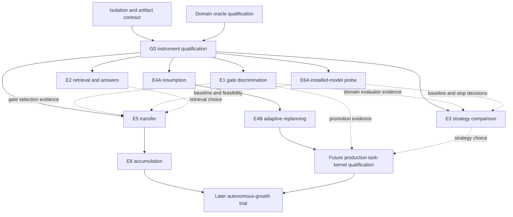

# FeralEcho — Capability Growth Reconciliation
Date: 2026-09-16. Investigator: Codex M5. Status: read-only adjudication and experimental design; no implementation.

## 1. Executive reconciliation

**Ruling:** retain the diagnosis, narrow the claims, repair the experimental program, and implement only an isolated Tier-0 measuring instrument if Richie separately approves. Do not start a production task kernel merely to test whether it would be valuable.

Claude's central criticism is correct: the original E1–E7 do not measure successive acquisition with retention and interference controls. Even complete success would not establish accumulation or sustained autonomous competence growth. Repaired E5 can establish bounded procedural transfer; E8 is required for the accumulation claim.

Several stronger assertions in Claude's review do **not** survive:

- Three measurements are a useful minimum structure for two successive acquisition stages, not three independent observations or a universal law of learning.
- Monotonic measured improvement is unnecessary. Stable earlier-family performance can show retention but cannot alone show accumulation.
- An embedding-distance floor is neither necessary nor sufficient evidence against duplication.
- A different generator is a robustness test, not a prerequisite for transfer within a specified generator.
- E2 already measures downstream answer correctness; it is not restricted to retrieval recall.
- Distinct company/model ancestry does not guarantee independent errors or untainted evaluation.
- E1 failing to beat a heuristic does not automatically invalidate every deterministic evaluator in the program.
- E5 and E8 research do not require a future production task kernel.
- The review's near-100% concurrency-defect claim has no enumerated denominator and is not an established base rate.

**Architecture:** RETAIN WITH CHANGES. Keep deterministic authorization, budgets and durable experiment records around fallible reasoning workers. Separate research instrumentation from production scheduling. Judge empirical improvements with independent outcome contracts and preserve unknowns rather than infer correctness from infrastructure activity.

**Scope of readiness:** READY TO IMPLEMENT means the specification can be encoded and validated as a standalone experiment after authorization. It does not mean the instrument has passed its preflight, model execution is presently authorized, a statistical hypothesis is true, or production should depend on it.

**Confidence:** high in the transfer/accumulation distinction and the inspected attribution gaps; moderate in the architecture priority ranking. Model-execution feasibility, evaluator performance and learning gains remain untested hypotheses.

## 2. Mission integrity and observation boundary

Opening HEAD: **2fba42644c82b9f7096276f4dd338d615cf1bcce**. Opening full short status: **176 entries**, including 27 modified tracked paths and 149 untracked paths. Full listing in §26. First source interpretation occurred only after Git/process capture.

Initial process identities, local Pacific time as reported by ps:

- FeralEcho run.py: PID **7644**, started **September 10, 22:41:53**.
- Watchdog start_echo.sh: PID **7636**, same start time; log tee PID **7645**.
- Ollama serve: PID **13534**, started **September 2, 16:10:09**.
- Existing relay listeners: PIDs 5799, 5828 and 20183. No relay message, hub check or listener mutation occurred in this mission.

The user resumed this investigation after an interval. Initial process capture was at approximately 10:35 UTC; later artifact reads were after 16:58 UTC. These are time-scoped observations, not a simultaneous snapshot.

Methods: plain-text source/report reads, static call-path analysis, JSONL structural aggregation, local Ollama manifest/small configuration-blob reads, official Ollama documentation/source inspection, Git read-only commands and read-only process inspection. **No production imports, pickle deserialization, inference, live FeralEcho/Ollama API call, experiment rerun, model loading or scratch-file creation.** In-memory JSON/hash calculations only. Full model-weight blobs were not rehashed or loaded.

Working-tree source is the current evidence. HEAD alone omits substantial changes. Source existence is labeled OBSERVED(source), not production-path proof. OBSERVED(artifact) proves the contents of a record, not necessarily everything it asserts. SUPPORTED combines evidence; INFERRED is reasoning; PROPOSED denotes a testable design.

Reports under adjudication:

- **C:** [original Codex investigation](2026-09-16_feralecho_zero_cost_capability_ceiling.md).
- **A:** [Claude adversarial review](2026-09-16_codex_capability_ceiling_adversarial_review.md).

Neither is treated as an authority. Their hashes and primary evidence references appear in §25.

## 3. Disagreement matrix and adjudication trail

The five columns below implement the requested ORIGINAL CODEX POSITION → CLAUDE CHALLENGE → INDEPENDENT RECHECK → VERDICT → CONSEQUENCE structure. E1 and E5 receive separate point-by-point rows in their specifications.

| ID / ORIGINAL CODEX POSITION | CLAUDE CHALLENGE | INDEPENDENT RECHECK | VERDICT | CONSEQUENCE |
|---|---|---|---|---|
| D1. C proposes E1–E7 toward competence growth but reserves a longitudinal claim in §20. | Even all seven successes do not establish accumulation. | C:E5 has one teaching/transfer interval; other experiments add no sequential acquisition/retention design. | ACCEPT CLAUDE | Add E8; no accumulated-growth claim from E1–E7. |
| D2. C leaves longitudinal duration unspecified. | At least three independent time points and monotonic/non-decreasing improvement. | Repeated measurements of the same learner are dependent; noisy trajectories can support a causal gain. Two acquisition intervals require distinguishing at least baseline/A/AB states, which can be evaluated later from checkpoints. | ACCEPT WITH MODIFICATION | Require sequential state evidence and controls; no independent-time-point or monotonicity assumption. |
| D3. C says episode controls and held-out variants test procedure transfer. | Embedding floor and cross-generator success should be requirements. | Distant embeddings can hide isomorphic solutions; related tasks may properly be close. Transfer is conditional on a specified solver; changing solver tests portability. | ACCEPT WITH MODIFICATION | Strengthen duplicate checks and blindness; reject embedding floor and cross-model success as universal prerequisites. |
| D4. C requires independent outcomes but incompletely specifies judge separation. | Deterministic tests preferred; other judgments contaminated by default; E7 uniquely independent. | Tests avoid model self-rating but can be flawed/leaked. Different providers can share data/errors. Independence has access, authorship and error-correlation dimensions. | ACCEPT WITH MODIFICATION | Evaluator hierarchy in §8; distinguish risk from demonstrated contamination. |
| D5. C:E2 includes answer correctness, recall, unsupported claims and latency. | E2 only shows retrieval improvement and says nothing about downstream reasoning. | The actual metric and success criterion explicitly include downstream correctness. Corpus-aware question authorship still needs controls. | REJECT CLAUDE | Retain answer metrics; repair question construction. Success can license answer improvement, never experience-driven learning by itself. |
| D6. C:E3 explicitly verifies baseline requests. | Every intervention must prove its executed path. | Behavioral-experiment source clears DIRECT_ECHO_TASKS once before the loop; A/B arguments cannot restore the direct path. | ACCEPT CLAUDE | Transport-observed manifests and symmetric validation for every arm. |
| D7. C:E4 combines interrupted-job recovery and completion. | A replay engine can pass without adaptive replanning. | Checkpointing does not require selecting a new valid action after changed conditions. | ACCEPT CLAUDE | Split E4A resumption and E4B replanning; report authority separately. |
| D8. C puts model/backend work at Tier 5 but explicitly allows cheap installed-model comparison earlier. | E6 should run at Tier 0 or orchestration work may be wasted. | Early model comparison can change priorities; better models do not remove authorization, evidence or persistence needs. C already partly anticipated this. | ACCEPT WITH MODIFICATION | E6A early, E6B later; no blanket claim that earlier architecture investment would be wasted. |
| D9. C requires complete attempt attribution. | Existing synthesis-integrity hashes may solve much of it. | Actual logger records candidate model/hash/preview/length and selected result; missing call IDs, payloads and several paths; trace IDs frequently repeat. | ACCEPT WITH MODIFICATION | EXTEND concept/schema in standalone instrumentation, not use historical log as complete ledger. |
| D10. C asks for model/version manifests. | Digest/quantization feasibility unresolved. | Local manifest/config layers identify Echo 8B Q4_0 cheaply; API documentation distinguishes tag inventory from per-call response. No per-inference loaded-byte attestation established. | ACCEPT WITH MODIFICATION | Record identity strength; metadata binding required for confirmatory generation comparisons, attestation not a prerequisite for harness construction. |
| D11. C recommends isolation and prior tests reveal writer gaps. | Redirect each path and disable autonomous workers during experiment. | River redirect-before-construction protects that global; other paths and network/residency remain. Stopping live workers violates this mission and is unnecessary with separate state. | ACCEPT WITH MODIFICATION | No live-worker disabling; isolated experiment workers have no production startup path. Enforce OS boundaries. |
| D12. C's ladder/roadmap builds toward reusable competence. | Durable goals must precede procedure memory, and E1 success must precede all trusted outcomes. | A standalone task harness can apply a procedure. Known finite-output oracles can be validated independently of a gate-superiority trial. | REJECT CLAUDE | G0 instrument validation is hard dependency; E1 superiority is domain-specific evidence, not universal certification. E5 can precede production kernel. |
| D13. C flags central state/concurrency risks. | Historical concurrency defect rate is near 100%. | Neither report supplies an unbiased census of new mechanisms and failures. Real races support risk, not that numerical rate. | ACCEPT WITH MODIFICATION | Concurrency threat model and fault injection mandatory for future executor; discard asserted near-certainty. |
| D14. C mentions evidence storage/context cost. | Full attempt records could grow and consume model context. | Evidence ledger need not be included in prompts; immutable shared payloads avoid duplicate storage. | ACCEPT WITH MODIFICATION | Out-of-band manifests, content-addressed payloads, bounded telemetry, permanent denominator records. |
| D15. C says hub notes share Claude's read cursor. | Fix landed after original report. | Current notes.py:208 calls read-hub; relay.py uses _HUB_MARKER_FILE. check_hub still hardcodes claude-m5. | ACCEPT WITH MODIFICATION | Cursor-sharing finding superseded for these paths; attribution issue remains. Mtime alone would not prove a fix. |
| D16. C allows optional frontier assistance. | Use remaining Claude time for evaluation contract, E5 set and concurrency threat model; no Tier 2 before October 1. | Durable artifacts have value; no evidence proves validation cannot finish before a calendar date. | ACCEPT WITH MODIFICATION | Prioritize artifacts/blind role separation; gate Tier 2 by evidence, not October 1. No rushed dependency on Claude. |
| D17. C's diagnosis prioritizes outcome/credit, persistence, context/strategy. | Diagnosis upheld but tests under-specify its proof. | Fresh attribution source supports credit gaps; design reasoning supports weak longitudinal evidence. Base-model dominance remains experimentally open. | ACCEPT WITH MODIFICATION | Diagnosis MODIFIED: ranking remains an architectural hypothesis, not a causal decomposition of all errors. |

## 4. Longitudinal and accumulation adjudication

### Q1 — Does E5, perfectly executed, establish only transfer?

**Yes, at most scoped transfer plus any explicitly tested durability.** The original E5 compares frozen procedures with episode/no-memory controls on withheld variants. It does not observe successive learning stages. It could fail to establish even transfer if no-answer controls, duplicate separation, outcomes or provenance fail. Repaired E5 below adds restart/delay tests and can license durable transfer over that interval. It still does not establish accumulation.

### Q2 — Can E1–E7 jointly establish accumulation without another longitudinal experiment?

**Not as specified.** Evaluator superiority + better retrieval + strategy efficiency + resumption + transfer + model comparison + peer critique do not jointly imply successive retained gains. Extending E5 to include E8's sequential acquisitions and controls would answer it without the name E8, but that is substantively an additional experimental design. The requirement is evidence, not numbering.

### Q3 — Minimum distinctions

- **Durable transfer:** a fixed lesson improves genuinely withheld related tasks versus matched controls, survives restart/reload and a declared delay with no reteaching. State-readable-after-restart alone is insufficient.
- **Cumulative learning:** at least two distinct acquisitions contribute useful held-out gains in the combined state; earlier benefit remains materially retained after later learning, and aggregate fixed-battery performance exceeds first-acquisition and no-learning controls. A bag of stored procedures or stable A-only performance is insufficient.
- **Sustained competence growth:** cumulative gains survive additional learning/ordinary bounded activity over a declared horizon with interference, efficiency and generalization monitored. Claims name the number of transitions and elapsed duration. Finite experiments do not establish indefinite growth.
- **Autonomous competence growth:** the system, within a human-defined domain and authority, selects weaknesses and interventions from permitted experience, completes validation/retention decisions without hidden human rescue, and satisfies the sustained-growth controls. Humans may set values, budgets, admissible domains and evaluator contracts in advance. Doing so does not invalidate autonomy. Selecting every next lesson or repairing failures for the system does.

### Q4 — Are three time points necessary?

**Necessary for the simplest directly observed two-stage design, not a universal scientific minimum.** Baseline S0, post-A S1 and post-AB S2 distinguish successive acquisitions. Checkpoint replay can evaluate all three later; ablations of independently acquired lessons can also support their joint contribution. “Three independent time points” is incorrect: shared learner, families and tests induce dependence. This program uses T0–T3 because the fourth checkpoint adds cumulative and interference stress, not because calendar labels confer validity.

### Q5 — Must performance increase at every measurement?

**No.** Evaluate preregistered task/family-averaged effects, confidence bounds and retention margins against controls. Sampling noise, varying task difficulty and bounded negative interference may produce non-monotonic scores. Do not smooth away failed stages or choose the most flattering checkpoints afterward. A persistently declining or bounded-no-benefit trajectory defeats the specified growth claim; a single small dip does not.

### Q6 — Retention versus interference

Retention asks whether the same acquired lesson still helps after storage/restart/time with no new lesson. Compare the post-A state immediately and later under identical exposure controls.

Interference asks whether adding B changes performance on A beyond time/retest effects. Compare continued-learning AB with a parallel A-only frozen branch measured at the same later time, at equal inference/retrieval budgets. Preserve per-family results and original-post-A anchors. Report both absolute retained gain and the incremental harm caused by subsequent learning.

E8 uses frozen-after-A and latest-only controls because no-learning alone cannot separate forgetting, crowding, one-time transfer and cumulative retention.

## 5. Final claims ladder

### Adjudication of the proposed levels

| ORIGINAL CODEX POSITION | CLAUDE CHALLENGE / PROPOSED LEVEL | INDEPENDENT RECHECK | VERDICT | CONSEQUENCE |
|---|---|---|---|---|
| Mechanism execution is weaker than learning. | L0: a log/write establishes activity. | A record can be wrong, synthetic or incomplete. | ACCEPT WITH MODIFICATION | Require observed/corroborated execution; name the tested setting. |
| Persistent data is not competence. | L1: readable state after restart. | Restart is one persistence stress; evidence can also establish a narrower storage interval. | ACCEPT WITH MODIFICATION | Name the tested persistence boundary rather than certify all stores. |
| Experience must change a later decision. | L2 requires the actual production path; scheduler adaptation called behaviorally verified. | Controlled snapshot evidence can establish scoped adaptation. Source consumers alone do not establish a controlled effect. | ACCEPT WITH MODIFICATION | Separate scope from strength; do not newly certify production adaptation here. |
| Independent outcomes distinguish useful learning. | L3 requires no shared ancestry; a single before/after result suffices. | Ancestry is neither a complete independence test nor a substitute for counterfactual control and uncertainty. | ACCEPT WITH MODIFICATION | Use task-appropriate independent outcome contracts and controlled estimates. |
| Withheld variants test transfer. | L4 adds embeddings and cross-generator requirements. | Non-duplication matters; those particular requirements do not define transfer. | ACCEPT WITH MODIFICATION | Keep L4, repair blindness/controls, add an explicitly tested durability qualifier. |
| Longitudinal growth was left open. | L5 requires successive retained lessons, with strict time/trajectory wording. | Successive useful acquisitions and interference controls are distinct from single transfer. | ACCEPT WITH MODIFICATION | Keep accumulation; separate sustained-horizon qualifier and remove monotonicity rule. |
| Autonomy must close control and learning loops. | L6 adds independent weakness/intervention selection. | Human-set authority and advance success criteria are compatible with autonomy; human rescue or lesson selection narrows it. | ACCEPT WITH MODIFICATION | Require bounded autonomous acquisition plus demonstrated growth; do not equate deployment with achievement. |

The ladder orders stronger claims; it is not a claim that every system must demonstrate all lower levels in one production deployment. Evidence from a faithful isolated snapshot is legitimate if wording names that scope. Production validation is a separate scope axis.

| Level / permitted wording | Required evidence | Insufficient evidence | Falsifier / claim-defeating result | FeralEcho already demonstrated? |
|---|---|---|---|---|
| L0 — Activity: “This operation ran in this setting.” | Observed operation/result with time/identity, or corroborated artifact. | A function name, aspirational comment, unverified model assertion. | Claimed operation absent/misattributed; only a mock ran. | **Yes, bounded:** real stored generation/council/attempt records and process evidence. |
| L1 — Retained state: “This recorded state remained readable/reloadable over interval X.” | Same versioned state read after delay/reload; production restart if claimed. | Merely a successful write acknowledgment. | State missing, reset, incompatible or unrecoverable at declared boundary. | **Partial:** historical durable files are observed; this mission does not perform a restart test or certify every state store. |
| L2 — Experience-dependent adaptation: “Prior experience changed a later decision under controlled inputs.” | Counterfactual state comparison with same input, bounded stochastic repeats, actual decision/input observation. | Code could read a field; count increases; different random outputs alone. | Adequately powered effect bounded negligible or no decision consumer on claimed path. | **Supported structurally, not newly demonstrated causally here:** River means and scheduler history have consumers. No blanket controlled-production L2 claim. |
| L3 — Outcome improvement: “Intervention X improved outcome Y on distribution D.” | Valid independent outcome contract, controlled baseline, task-level effect/uncertainty and cost. | Heuristic/self-rating improvement; one lucky before/after run. | Confirmatory effect bounded below meaningful benefit, or specified regression guard fails. | **Limited historical experiments exist; broad current competence improvement not established.** No inference from the 18/20 vs 17/20 retest alone. |
| L4 — Procedural transfer: “Acquired procedure(s) improved withheld related tasks for solver/version V.” | Frozen lessons, withheld structurally distinct tasks, matched episode/no-memory controls, family-level inference and appropriate non-application. | Replaying old answers, storing procedures, retrieval accuracy alone. | Benefit confined to duplicates, disappears on transformations, or material negative transfer. | **Not established by these reports.** Repaired E5 tests it. |
| L4D — Durable transfer qualifier | L4 plus fresh-process reload and declared delayed testing, without reteaching. | State persistence without retained task benefit; cross-model failure alone. | Benefit lost beyond margin after the declared persistence stress. | **Not established.** |
| L5 — Accumulation: “Multiple acquired lessons jointly increased fixed-battery competence with bounded interference.” | Successive acquisition states, no-learning/latest-only/frozen controls, retained earlier gains and aggregate gains beyond first lesson. | One transfer effect, larger procedure inventory, A-only retention. | Later learning adds no independently useful gain or erases earlier benefit past margins; drift/leakage explains result. | **Not established.** E8 required. |
| L5S — Sustained-growth qualifier | L5 across additional transitions and specified duration/activity stress, predeclared guard battery and budgets. | Assuming one day implies a month; strict monotonicity imposed after observing noise. | Gains fail declared later tests/efficiency guards or rely on changing model/environment. | **Not established.** |
| L6 — Bounded autonomous competence growth | L5S with autonomous weakness choice, intervention generation, evaluation/retention within fixed authority and acquisition/solve budgets; external hidden audit independent. | Human chooses each lesson/candidate or repairs each blockage; reduced approvals alone; greater compute alone. | Gains require hidden human rescue, authority expansion, evaluator manipulation or budget growth. | **Not established.** E8's human-scheduled version does not license L6. |

Two changes to Claude's ladder are deliberate. “Any regression on any stratum” is replaced by preregistered material-regression guards, not an impossible demand that every noisy cell improve. “Independent evaluator” is access/information independence plus validated error properties, not merely different ancestry. A negative finite study usually defeats the tested effect size, not every possible learning mechanism.

## 6. Final Tier-0 outcome/attempt contract

Tier 0 is a **standalone evidence-producing harness**, not the production scheduler, RiverBrain interface or general agent framework. Its initial task domain is finite, deterministic Python/data-transformation problems with explicit I/O contracts. It must operate on immutable task fixtures and private artifacts without importing FeralEcho's top-level application.

### G0 — Instrument qualification, distinct from E1

Before any empirical comparison:

1. Parse/validate schema and immutable payload references; reject missing/duplicate IDs, inconsistent ordering and unresolved required references.
2. Correctly classify at least 24 deterministic qualification cases: known correct/incorrect candidates, syntax failure, timeout, malformed output, forged ALL_TESTS_PASSED text, duplicate completion, missing event, changed prompt and forbidden write attempts to **sacrificial fixtures**.
3. A separately implemented checker must detect planted direct-as-council and unrecorded-call manifests in mocked transport. Report all planted anomaly classes; no claim beyond tested classes.
4. Demonstrate outcome decisions come from the trusted checker, not candidate stdout/comments or a test result JSON the candidate can edit.
5. Qualify OS isolation and interruption recovery of the harness evidence writer. Measure overhead; no model required.
6. Freeze instrument version and qualification artifacts. If any known case is misclassified, do not interpret model trials until repaired and requalified.

G0 validates the instrument's mechanics on known cases. **E1** asks whether a candidate-selection gate generalizes better than a heuristic. These are different hypotheses.

### Minimal records

| Record | Required data |
|---|---|
| Run | run_id, protocol/schema version, task distribution/split IDs, frozen manifest hashes, authority profile, resource ceilings, environment/version binding, start/end and completion status. |
| Task | task_id, family/episode ID, specification/reference hash, baseline artifact, objective/guard contracts, split, declared eligibility and scoring policy. |
| Attempt | attempt_id, task_id, parent_attempt_id or null, retry reason/exposure, arm assignment, randomization block/seed policy, start/end/status; every assigned slot retained. |
| Call | call_id, attempt_id, causal parent call/result IDs, boundary route, requested model and identity-strength reference, exact request payload reference, response/termination/usage reference, timestamps. |
| Action/observation | tool/action name, granted capability, schema/input/output refs, executor identity/version, success/error class and causal parent. No opaque “success” without result type. |
| Outcome | candidate artifact hash, gate decision, gate version, independent oracle label/unknown, task metrics/guards, cost, condition-validity decision, failure/exclusion reason if any. |
| State transition | input state hash, permitted experience IDs, update/procedure hash, output state hash, checkpoint parent and mutation authority. Only for stateful experiments. |
| Run close | assigned/completed/failed/unknown/integrity counts, content inventory, hashes, sealed analysis plan and verification result. Missing close means incomplete, not zero failures. |

Requests preserve role order, tools, injected notes and normalized options after all harness transformations. Raw transport JSON bytes and decoded content can have separate hashes; do not canonicalize away meaningful message ordering. Store null/unknown and the reason instead of fabricated defaults.

**Out-of-band only:** run IDs and ledger manifests are not appended to model context. Models receive only task-relevant evidence required by the condition. Baseline/reference hashes and required metadata are stored once per run and referenced per call. Benchmark target: under 2% added generation wall time for full capture in a fixed-output stub/mocked benchmark and later measured real-call check; report CPU-check overhead separately. Exceeding this triggers optimization or explicit overhead qualification, not dropping essential evidence.

### Identity strength and requiredness

**REQUIRED FOR TIER 0:** actual request/response identity, task/candidate/gate/oracle versions and paths, parentage, condition validation, authority/cost limits, effective explicitly controlled options, and an honest identity-strength record. Offline G0/E1 can evaluate immutable candidates without any new model inference. For **confirmatory generated-arm attribution**, require a stable model+template+backend binding across the comparison; unknown binding permits exploratory analysis only.

**STRONGLY DESIRABLE:** human-readable quantization/parameter count if derivable from a pinned manifest; backend build string; actual token/load statistics; tokenizer/rendered-template details; resolver checks at both block boundaries. A digest plus pinned layer/config references can suffice without repeatedly expanding every descriptive field. Missing latency/load data blocks a latency-specific claim, not a deterministic candidate-gate comparison.

**OPTIONAL:** device serial/OS hostname, repeated full hardware inventories, full probability vectors, unrelated ambient telemetry. Per-call loaded-weight cryptographic attestation is not required for a scoped controlled experiment and is not claimed available.

Requiredness is **claim-relative**: a field can be essential for fixed-model accumulation but irrelevant to scoring a saved candidate. Tier 0 must encode that distinction rather than refuse all work until maximal provenance exists.

## 7. Attribution and model-identity findings

### 7.1 Static feasibility

**OBSERVED:** the local file `~/.ollama/models/manifests/registry.ollama.ai/library/echo/latest` is a small manifest with SHA256:

`8cbcbe23800bfe9cecc5ef7dcc88fcb842be179c788601334d991b640d07abd6`.

It matches the inventory digest observed during the previous mission; no live inventory call was repeated now. Manifest layers reference model bytes, license, template, system and parameters. Small configuration blobs were read and their own digest matches checked:

- model metadata: llama, 8.0B, Q4_0;
- template layer digest: `8ab4849b038cf0abc5b1c9b8ee1443dca6b93a045c2272180d985126eb40bf6f`;
- system layer digest: `4b2c83ccb175e5ce42e610bdf1fb1dd72efdf2886324b34807e6c315b3578f16`;
- params layer digest: `4729661a6672373fe0e8fdaad8611168964773de98de59dc8ac53cf618423846`, with num_ctx=8192, num_keep=24 and stop strings.

The large weight layer was referenced, **not independently rehashed**. The blob metadata's architecture field is not evidence of the Mac's CPU architecture.

| Field | What can be established | Boundary |
|---|---|---|
| Tag | Request and response model fields; local tag path | Tag can move. Never equate it with immutable weights. |
| Manifest digest | Hash local manifest; documented /api/tags inventory | Binds disk inventory, not an inference receipt. |
| Quantization/parameter size | Local config read and documented model metadata | Does not prove a historical runner loaded that configuration. |
| Model/template/system identity | Manifest layers; repository Modelfile hash and adapter source | Repository Modelfile may differ from installed model system layer. Record both when the adapter prepends one. |
| Explicit generation options | Exact outbound request | Defaults omitted by adapter are inherited, not necessarily known. |
| Actual context | Sent messages/tool schemas and refs after adapter transformations | Backend rendering/truncation/tokenization can add uncertainty. |
| Backend version | Installed binary/package evidence; documented API/source mechanisms | Active server build not established statically in this mission. UNRESOLVED, not absent. |
| Per-call loaded digest | Not present in documented ChatResponse schema inspected | Stable disk manifest/ps is supporting evidence, not cryptographic attestation. UNRESOLVED locally. |
| Residency/load | API ps and response load metrics are documented | No current call made. Cache/loading state remains observational, not assumed equal. |

Official primary references: [Ollama model inventory](https://docs.ollama.com/api/tags), [show-model details](https://docs.ollama.com/api-reference/show-model-details), [running-model inventory](https://docs.ollama.com/api/ps). They support feasible metadata capture, not proof of historical execution.

**OBSERVED(source):** app/ollama_handler.py:98 uses explicit messages unchanged, otherwise may prepend Echo's repository Modelfile SYSTEM. Nonstreaming chat defaults to num_ctx=8192, num_predict=512 and returns text, dropping other response metadata. Streaming capture currently retains done_reason through result_meta, not a full call record. river_deliberation.py:397 adds an English prefix for Qwen and has a subprocess fallback that drops supplied system content. Capture must be below these transformations, not from the experiment's intended prompt.

[Ollama chat documentation](https://docs.ollama.com/api/chat) describes ordered messages/tools/options and response duration/token fields. [Ollama API source](https://raw.githubusercontent.com/ollama/ollama/main/api/types.go), inspected as current upstream rather than the installed version, has model name in ChatResponse and no ordinary per-response digest. Do not rely on undocumented debug-render features in a minimal harness.

**Design:** later model trials use an experiment-owned backend process, read-only installed model artifacts, private caches/logs and disabled model mutation/cloud fallback. Resolve and record manifest/template/config identity before/after blocks, pin the backend executable and disallow model creation/pull/delete routes. This is a controlled experimental binding, not hardware attestation. If the host cannot supply it without changing production configuration, keep model experiments blocked at execution preflight and continue offline G0/E1 work.

### 7.2 Existing synthesis attribution

Verdict: **EXTEND**. Reuse structural concepts and historical adapters; do not append new experimental records to production logs.

**OBSERVED(source):** river_deliberation.py:1046 records ts, trace_id, task_type, n_valid_opinions, candidates with model/SHA1/preview/length, selection_method, missing_agreed_definitions and final-response SHA1/preview/length; optional name diagnostics. Ordinary accepted-synthesis records are coding-gated. Several direct/empty/all-error/solo paths are absent. Best-effort write errors are swallowed. The adjacent council log records raw/truncated candidate text, temperatures, prompt, final text and synthesis-model name, but not complete actual system requests.

**OBSERVED(artifact, later reads):**

- synthesis_integrity_log: 4,176 records; 160 null trace IDs; 1,605 distinct non-null trace IDs, of which 1,574 repeat. Selection methods: 3,546 synthesis_accepted, 626 completeness_fallback, 3 full_agreement_shortcut, 1 empty_or_error_fallback.
- council_deliberations: 6,301 records; 693 null trace IDs; 4,103 distinct non-null IDs, 1,074 repeated. 3,271 direct_echo_task and 3,030 real_deliberation records.
- Records and log coverage are not one-to-one. Aggregations were plain reads, not execution.

Hashes identify textual candidates/selected outputs; they do **not** establish candidate correctness or causal contribution. On completeness fallback, the record's final response is the chosen candidate, while rejected synthesis full text need not survive there. On accepted paths, post_synthesis_hook may alter output before the integrity record. A matching candidate hash proves identity of text, not why a synthesis succeeded.

**Specific credit consequence:** normal code learns from each non-synthesis model's opinion and gives final-output learning to the synthesis model. Agreement/fallback can give that model credit for selected candidate text even if it did not generate it. More hashes alone do not fix credit assignment. Record generation, selection, verification and update as separate events. Candidate contribution can be described by artifact preservation or evaluated with ablation; causal credit cannot be read off a log.

Extend with unique call/attempt IDs, raw/generated/selected/postprocessed output refs, all terminal branches, transport observations and explicit update parents. Keep historical SHA1 as an alias; new content identity uses SHA256. No rewriting old records or assuming trace_id uniqueness.

## 8. Evaluator hierarchy and independence adjudication

| Task class | Preferred evaluator | What it licenses / limitation |
|---|---|---|
| Finite exact I/O, numeric, schemas, exact source facts | Trusted deterministic comparator against an independently validated reference; exhaustive finite cases where feasible | Exact tested property within domain. Tests can be wrong/incomplete; stdout marker is not success. |
| Code/procedures with large input space | Independent hidden functional/property tests, regression invariants, reference implementations and mutation checks | Tested-distribution correctness; not universal code correctness or safety. |
| Partially deterministic synthesis | Deterministic citation/existence/consistency checks plus blinded rubric judgment for remaining dimensions | Report objective and judgment scores separately; composite weights frozen. |
| Judgment-heavy usefulness/creativity | Blinded pairwise ratings using a fixed rubric, multiple reviewers where feasible, disagreements/uncertainty retained | Preference or rubric improvement on sampled users/tasks; not objective truth. |
| High-consequence ambiguous choices | Human authority plus evidence review | Authorization/value judgment; separate from competence score. |

A deterministic checker is sufficient when the **entire claimed property** is decidable by that checker on the specified domain. Passing syntax alone is not sufficient for functional correctness. A generator cannot read or alter reference answers, hidden tests or test outcome artifacts.

Same-model or shared-ancestry evaluation can be an inexpensive **secondary correlated judgment**, calibrated against independently labeled examples. Shared ancestry invalidates claims of independence based solely on having two model names, not every possible blinded evaluation. Different ancestry reduces one known dependence, but shared training data, prompts, mistakes and access can remain.

Claude/Codex review is useful for frozen test construction, mutation challenges and blind disagreement resolution. It is not a guaranteed oracle, and it expires/has quotas. Human review is required for genuinely subjective stakes and unresolved test ambiguities, but can occur during preconstruction instead of every runtime tick. Objective trials must remain runnable without external peers.

Safety, functional outcome, regression, authority, transfer and calibration each have their own metric. Never let one passing score certify the others. A created test file or a “verified” label is not evidence that its oracle has been independently validated.

## 9. Repaired E1 — Candidate-gate discrimination

### Point-by-point adjudication

| ORIGINAL CODEX POSITION | CLAUDE CHALLENGE | INDEPENDENT RECHECK | VERDICT | CONSEQUENCE |
|---|---|---|---|---|
| E1 allowed archived/isolated candidates. | Historical selection by old heuristic biases population. | Archives can exclude failures or reflect old generator/routing choices. Bias direction unknown; not automatically invalid if scope is archive-only. | ACCEPT WITH MODIFICATION | Fresh, unscreened confirmatory pool; historical material development/secondary only. |
| 40 tasks × three candidates; repeats not independent stated generally. | Unit not precise enough. | Candidate outcomes can be measured but uncertainty must cluster by task/family; 120 is not 120 independent tasks. | ACCEPT CLAUDE | Task/family-blocked estimands and sample size below. |
| Parent/retry provenance not fully specified. | Retry conditioned on failure is dependent. | self-edit source uses error-conditioned retry prompts. | ACCEPT CLAUDE | Three initial candidates with no cross-candidate feedback; separate retry-chain secondary cohort if used. |
| Recall guard and reject-all failure named. | Denominators/absolute recall undefined. | Relative recall alone can be vacuous if old gate recall is low or no true improvements exist. | ACCEPT CLAUDE | Absolute recall floor, improvement-positive support and coverage reported. |
| Success described evaluator improvement. | Only tested distribution licensed. | Gate performance is conditional on tasks, generators, candidate policy and independent oracle. | ACCEPT CLAUDE | Narrow wording; no learning/accumulation certification. |

### Implementable specification

**Hypothesis:** a separately validated hidden-test gate reduces false promotion versus the current-style heuristic gate while retaining true improvements on fresh bounded code-task candidates.

**Standalone task contract:** pure Python functions over JSON-compatible finite inputs (e.g., list/table transformations) in a declared domain. Each task has a specification, known baseline artifact and protected regression cases. Avoid arbitrary repository imports and filesystem effects. Baselines are frozen before generation and include both known correct and deliberately incomplete cases.

**Candidate generation:** fresh outputs, three slots per task. Use one fixed already-installed generator with a pinned request/version profile; another generator is a separately labeled replication, not pooled silently. Each slot starts a clean context with the same task/baseline/public examples, independently scheduled seed and no result feedback. No old gate screens the pool. Safety failures, empty/invalid code and timed-out slots remain recorded. A small hand-constructed mutation pool qualifies G0; it is not substituted for the fresh E1 outcome population.

**Retries:** none in primary candidate pool. Transport retry before any response follows a fixed idempotency policy and retains both attempts. Error-conditioned code repair, if studied later, is a chain with parent IDs and disclosed extra information; cluster the chain within task, report a separate estimand. Never promote its second attempt to an independent first draw.

**Three information compartments:**

- Public spec/examples: generator sees these.
- Gate test set G: candidate gate sees its results; generator never sees G, feedback or source. G author can see spec and development tasks.
- Final reference/oracle set O: independently owned, inaccessible to generator and G designer for confirmation; constructed from spec, trusted finite reference and hidden edge cases. O is not the same suite used to decide promotion.

Separate author roles and process/file access; different models alone do not establish blindness. The task-definition custodian may know both sets but must not author candidates or tune G using confirmation outcomes. Retain role/access declarations. A human/Claude collaborator can prepare sealed O before expiration; ongoing evaluation is deterministic.

**True improvement:** let u be the predeclared fraction of finite/reference cases correct. Candidate is a true improvement iff all mandatory safety/authority and protected regression guards pass and u(candidate) − u(baseline) ≥ **0.10** on O. For tasks with binary all-or-nothing contracts, use baseline-fail → candidate-pass instead and keep that stratum separate. Baseline already at ceiling has no true functional improvement under this claim; ties are non-improvements, though other claimed goals would require a new contract.

**Old gate H:** versioned, isolated extraction/reimplementation of sandbox import/execute success plus quality(candidate) ≥ quality(baseline), matching relevant source behavior and verified on fixture cases. This is a snapshot heuristic analogue, not a production deployment. No execute_self_edit import. **New gate G:** all mandatory gate properties and ≥0.10 G-suite functional gain; all-or-nothing stratum as above. G cannot consume O. Both score exactly the same candidates.

**Metrics/units:** for each task i, average over its three assigned candidate slots:

- false-promotion burden F_i = promoted-and-not-truly-improved slots / 3;
- correct-promotion yield Y_i = promoted-and-truly-improved slots / 3;
- coverage = promoted slots / 3.
True-improvement recall is promoted true improvements / all true improvements, estimated with task/family clustering; also report the mean task recall over improvement-positive tasks and their count. False discovery among promoted outputs is a separate diagnostic, undefined—not zero—if none are promoted.

No-output slots are abstentions and not true improvements; retain their costs in end-to-end yield. Oracle-infrastructure failures produce UNKNOWN, never false correctness labels; report worst/best-case bounds. To pass, the conclusion must survive conservative bounds with at most 5% unresolved oracle cases. Higher failure rate invalidates confirmatory interpretation. One identical-artifact retry for an infrastructure failure is allowed by a frozen policy; all errors remain visible.

**Statistical unit:** task is paired across gates; if multiple tasks share a procedural family, family is the inference cluster. Use one task per family in the minimal confirmatory population where feasible. Candidates and seed repeats do not increase independent N.

**Development/confirmation:** 20 development tasks, then a 20-task calibration pilot with disjoint families. Freeze candidate policy, G and O ownership before confirmation; pilot tasks are never reused for confirmation. Historical candidates may be used only during development and reported as such.

**Sizing rule:** preregister a script that resamples entire pilot task/family clusters, preserving three-slot correlations and improvement prevalence. Search N=60,80,...,240 fresh clusters for ≥90% simulated probability of simultaneously meeting the inferential bounds below under the planned alternative (F reduction 0.15, recall difference 0, true recall 0.90), at one-sided 2.5% error per primary bound; require ≥30 improvement-positive clusters expected. Use conservative pilot uncertainty in variance/prevalence. If no feasible N exists, label confirmation infeasible at current budget; run/interpret pilot only, or revise design before any new unblinding. No optional stopping or collecting until significance.

**Success:** point reduction F_H−F_G ≥0.10 and its lower one-sided 97.5% cluster bound >0; recall lower bound ≥0.80; recall(G)−recall(H) lower bound >−0.05; no authority breaches and qualification/condition checks pass. This demonstrates a measured ≥10-point reduction with evidence of a positive effect, **not** that the population reduction is proven at least ten points. Claiming that stronger threshold would require its confidence bound ≥0.10 and a new sizing target.

**Failure:** G0 error, leak, invalid oracle or uncontrolled condition means instrument/design failure; benefit confidence interval excluding a meaningful benefit is evidence against this gate hypothesis; wide interval is inconclusive. Reject-all fails recall/coverage. If too few true improvements exist, evaluator sensitivity remains untested: investigate generator/task mismatch, not manufacture successes.

**Test reuse:** each confirmation O suite is used only for this frozen candidate batch, with no feedback to generator/G until sealed analysis. Publicly inspected items become development thereafter. Re-evaluating identical bytes for deterministic reproducibility is allowed; changing candidates/gate after results requires new confirmation families.

**Licensed claim:** “On this specified fresh generator/task distribution, gate G selected O-defined improvements more reliably than heuristic H with the reported recall and compute.” It does not establish universal evaluator validity, procedure transfer, autonomous learning or accumulation.

## 10. Repaired E2 — Evidence retrieval and answer quality

**Adjudication:** ACCEPT WITH MODIFICATION on question-construction bias; REJECT the assertion that original E2 lacks downstream metrics. Seeing the corpus is often necessary to author gold questions. The problem is access to retrieval behavior or tuning questions to a particular index, not corpus awareness itself.

**Specification:**

- Freeze a read-only corpus snapshot (source bytes, episode IDs, timestamps, provenance and authority types) before indexing comparisons. Synthetic/private task corpora, not live production memory, are the initial default.
- Independent question authors see raw source episodes, not retriever outputs/rankings or index internals. Combine realistic user-intent templates with corpus-grounded questions. Freeze questions, gold evidence sets, accepted answers and no-answer definitions **before any retrieval run**.
- Separate development and confirmation episodes by whole source/temporal lineage. Held-out episodes **remain in the test retrieval corpus**; they are held out from tuning and question/procedure development, not removed so the answer becomes unknowable.
- Check text hashes, n-gram overlap, source lineage and paraphrase/semantic flags across splits. Manually adjudicate flagged duplicates while still blind to arm scores. Keep the adjudication record.
- Compare current-style dense/filtering baseline with pre-filtered lexical+dense fusion and bounded reranking. Frozen same generator, template, evidence access, total context/output/tool budget. No online memory writes. Equal maximum context tokens and output cap; report actual tokens. Do not pad with answer-bearing content to make lengths equal.
- 80-question pilot, 20 each: exact/source facts, episodic relations, temporal conflict, unanswerable. Two fixed seeds per arm, randomized paired blocks; question/episode-family clustering. No claim of N=160 independent samples.
- Temporal conflict gold specifies validity time, source priority and whether conflict should remain unresolved. No-answer corpus contains plausible distractors; abstention must follow unavailable evidence, not absence of a keyword.
- Retrieval metrics: eligible supporting-evidence recall@k, precision, contradictory-source coverage and retrieval latency. Downstream metrics: independently checked answer correctness, evidence entailment/citation accuracy, unsupported atomic claims, correct abstention and p50/p95 total latency.
- Pilot estimates confirmation size under the same cluster-resampling rule as E1, with fresh episodes, ≥90% target power for a 15-point alternative while requiring observed ≥10-point correctness gain and lower one-sided 97.5% bound >0. Unsupported-claim increase upper bound <0.05 overall; per-stratum bounds and unresolved cases reported, not hidden in aggregate. Predeclare ≤20% p95 latency increase as guard or explicitly choose a different latency tradeoff before testing.
- Failure: retrieval-only gain, answer regression, unsupported claims past guard, leakage or invalid corpus split. Wide confidence intervals mean inconclusive. Keep failed retrieval and no-answer cases.

**Success proves:** improved evidence retrieval **and**, only if that endpoint passes, improved answer outcomes under the fixed context/model/corpus contract. It does not prove that experience updated competence. Retrieval is an inference-time intervention here.

## 11. Repaired E3 and condition-integrity manifest

### Manifest and independent pre-analysis validator

Every trial retains assigned arm and an **observed path**. Record:
arm_id, task_id, family, attempt_id; all call IDs and requested/resolved model bindings; actual call count; system/user/tool-schema payload refs and hashes after transformations; TOOL-LIST presence/content ref **per call**; actual tool requests/results; council-entry event; candidate parentage; synthesis request event; agreement predicate input/output; fallback reason/path; raw/selected/postprocessed output hashes; per-call and total token caps/options; actual usage if returned; wall time and load/residency evidence or UNKNOWN.

A stage named “synthesis” is not proof: cross-check its transport request against a frozen recipe and linked candidate payloads. A tool name in TOOL-LIST is not a tool invocation. A one-member council-shaped log is not a direct call proof.

**Independent checker:** distinct from the arm dispatcher, consumes immutable gateway request/response events plus process-local branch events, verifies causal links/counts, recomputes deterministic agreement/bypass predicates from retained candidate bytes and checks expected prompt/schema hashes. It must pass G0 planted-mislabel tests before outcomes are unsealed. Block any backend route bypassing the recorder; unmatched responses/extra call IDs invalidate condition fidelity. This provides independent measurement relative to the treatment controller, not an infallible second oracle.

| Arm | Required observed execution | Forbidden/unexpected behavior |
|---|---|---|
| D — Direct | Exactly one generation request to frozen model; exact task/context recipe; no tools/synthesis. | Hidden council calls, retries without declared failure protocol, prior outputs. |
| T — Tool-first | ≤4 model calls; fixed allowlisted schemas; tool results linked into next messages; no council. | Unlogged tool I/O, arbitrary execution, learning between rounds. Zero tool calls permitted but classified tool-opportunity-not-used. |
| S — Sample/test/select | Exactly three independent candidate requests; public/gate tests in sandbox; fixed selector; zero synthesis calls. | Candidate seeing another output; selector seeing final oracle O; extra revision calls. |
| C — Snapshot council | Frozen working-tree selection/prompt construction; fixed starting ranking snapshot; up to three candidates, synthesis or valid agreement/fallback branch. | Live River learning/state, undeclared system changes, unrecorded subprocess fallback. |

C reproduces a specified snapshot mechanism, not necessarily every live production condition. Freezing a small score table into a read-only interface is preferable to loading RiverBrain. Validate copied/extracted logic against source fixtures. Extra baseline selection randomness is frozen per block; it is not secretly applied to other arms.

**Condition failure:** retain assignment, payloads and failure reason. Do not rename a mislabeled trial to the arm it happened to execute. Report intention-to-run task completion with such failures counted as failures, and a separate path-valid analysis. Any systematic path mismatch stops that protocol version. A repaired rerun is a new version/batch; old trials stay in denominators/report. Confirmation requires zero unresolved path failures; isolated stochastic infrastructure failures follow the declared policy.

### Final E3 design

Hypothesis: strategies improve success/cost tradeoff compared with snapshot council. Start with 24 objectively checkable tasks for pilot; then fresh task clusters sized for a predeclared 10-point task-success alternative or noninferiority margin 0.05. Two seeds per task/arm; randomized balanced order, independent clean arm processes and identical allowed evidence. Include an independently judged synthesis stratum later, scored separately.

Use two estimands:

1. **Bounded resource envelope:** same maximum total generated-token and tool budget (initial cap 6,144 generated tokens, total deadline six minutes); each strategy may use less. Also retain per-call context limits (initial 8,192) and prompt-token work. Unused compute is not artificially spent.
2. **Natural usage/latency:** report each frozen strategy at its declared recipe; no claim that unequal realized compute isolates architecture. A separate strictly matched realized-compute analysis is descriptive unless experimentally assigned.

Token caps are not identical FLOPs across models/context lengths. Claim “same declared budget” rather than exact compute equality unless a defensible compute measure exists. Freeze reasoning-token handling and count hidden thinking where backend exposes it; otherwise bound by total generation cap and state uncertainty.

Primary metrics: task correctness, success per inference-second, total time/calls/tokens and p95 deadline failure. Secondary: candidate oracle success versus selected/synthesized success, minority-correct result loss, unsupported claims. Final oracle results are unavailable to the selector.

Success: positive confirmed accuracy effect with observed ≥10-point gain inside budget, **or** success noninferiority lower bound >−0.05 with ≥25% median inference-time reduction and p95 ≤1.20× baseline. Hypotheses/multiplicity path chosen before confirmation, not whichever wins afterward. Failed guard or valid no-benefit interval changes roadmap; noisy pilot does not justify production routing.

Licensed claim: strategy performance on the tested frozen distribution/budget. It does not prove learned routing, task-type causality, accumulation or universal council harm.

## 12. Repaired E4 — Separate resumption from adaptive replanning

### E4A: persistence/resumption

Compare a checkpointed executor with a bounded stateless/replay baseline, same tasks/models/tools/authority. Initial 24 harmless sandbox workflows, two repetitions per arm; task-clustered analysis. Inject controlled termination of **experiment workers only**, between observation/commit/action phases. Verify exact state restoration, duplicate suppression and final objective outcomes.

Success: at least 90% eligible interruptions resume to valid terminal state, improved completion versus baseline, and no recorded duplicate consequential effects within fixtures. Claim persistence/resumption, not autonomy. Failure to restore state or repeated external-effect simulation defeats the persistence contract.

### E4B: adaptive replanning

Compare persisted fixed-plan replay with persisted executor allowed bounded observation/replanning. Initial 32 tasks, balanced four strata:

- file renamed after plan; discover via allowed directory lookup;
- schema changes with an explicit new schema file; update parser;
- a local dependency artifact becomes unavailable; use a permitted alternate artifact;
- legitimate unexpected tool result conflicts with plan; inspect and choose a new path, or correctly block.

Half of changed tasks have an authorized recovery; half require an unavailable capability and should block/escalate. Mutations affect only a synthetic world owned by the harness, never production files.

Require the trace to demonstrate mismatch detection, state update, a different valid next action, and correct completion or justified block. A prewritten branch table may be a competent policy; do not require an LLM to “truly reason” if observations and outcomes establish adaptive control. But simple restart of the unchanged plan cannot satisfy changed-world tasks.

Same initial plans, change schedule randomized after plan freeze, capped two replans/four observation steps and unchanged authority. Outcome metrics: valid completion, correct block rate, inappropriate escalation, repeated failed actions, detection/recovery time and authority attempted/landed violations. Separate solver correctness from “asked for approval less.”

Pilot success: ≥20-point correct-terminal-outcome gain over fixed-plan replay, ≥80% correct block behavior, and no authority violation. Confirmation uses fresh task clusters and sizing from pilot variance. Any landed unauthorized action aborts progression and triggers boundary repair. Clean results license only **no violation observed in the specified trials/profile**. Even with independent identically distributed opportunities, zero in 48 would yield an approximate one-sided 95% upper rate of 6.1%; correlated repetitions weaken that interpretation further. Not “proven safe.”

E4B supports bounded adaptive task execution, not autonomous selection of valuable learning goals or L6.

## 13. Repaired E5 — Procedural transfer, highest scientific priority

### Individual adjudications

| ORIGINAL CODEX POSITION | CLAUDE CHALLENGE | INDEPENDENT RECHECK | VERDICT | CONSEQUENCE |
|---|---|---|---|---|
| Held-out variants, confounds name duplicates. | Semantic duplication not operationally controlled. | Surface variations can share answers/algorithms trivially; need documented separation. | ACCEPT CLAUDE | Multimethod duplicate and transformation audit, blinded before outcomes. |
| Freeze procedure before testing. | Author could already know withheld tasks. | Freezing alone does not establish author blindness. | ACCEPT CLAUDE | Separate author/test custodian with access record. |
| Procedure/episode/no-memory arms. | Cross-family memory can leak. | Ordinary vector memory is shared; source filtering may happen after search. | ACCEPT CLAUDE | Dedicated family/arm stores and no production retrieval. |
| Independent tests left general. | Evaluator contamination for non-code families. | Open-ended evaluation under-specified. | ACCEPT WITH MODIFICATION | First E5 restricted to deterministic contracts; later subjective transfer separate. |
| Teaching tasks followed by withheld tasks. | Failed-teaching families could disappear. | Original denominator did not say what happens on failure. | ACCEPT CLAUDE | All assigned families retained; empty procedure state and costs included. |
| 24 out-of-scope cases/negative-transfer guard. | Ignoring all procedures passes harm guard. | Harm and applicability discrimination differ. | ACCEPT CLAUDE | Require positive acquisition plus related/near-match/unrelated applicability outcomes. |
| Compatibility and freeze in architecture, not E5 details. | Version portability untested. | No cross-version test can be inferred from one version. | ACCEPT WITH MODIFICATION | Pin dependencies and record compatibility; treat cross-model/version extension separately. |
| One teaching/transfer interval. | No temporal durability or accumulation. | True; restart/delay can test durability but not successive gains. | ACCEPT CLAUDE | Add E5-D qualifier and E8. |
| Related tasks and same solver allowed. | Embedding floor/cross-generator success required. | Embeddings and model swapping answer different questions from within-solver transfer. | REJECT CLAUDE | Use embedding similarity only to flag review; cross-model replication optional stronger evidence. |
| Equal token budget controls retrieval advantage. | Review accepts that as fully adequate. | Same length does not equal same information. Compression/access advantages may cause effect. | ACCEPT WITH MODIFICATION | Match teaching information available and include curated episode baseline; license representation/usage effect, not uniquely procedural internal cognition. |

### Final specification

**Hypothesis:** a procedure derived only from teaching experience improves task-family transfer beyond no-memory and information-matched episodic support, under fixed solver/authority/budget.

**Domain:** deterministic code/data transformations with externally checkable preconditions, finite fixtures/property tests and protected regressions. No opaque LLM-only judge in the first E5.

**Authorship/splits:** an independent custodian freezes family definitions, three teaching tasks, five withheld transfer tasks and negative controls. Procedure author/generator sees only teaching tasks, public contracts and observed teaching results. Test custodian does not write procedures. The experiment operator can run sealed tests but must not send withheld cases or output feedback to the learner. If role separation fails, mark contaminated family, keep its assignment in the report and do not claim clean transfer from it.

**Twelve families in pilot**, clustered at family, not 60 independent tasks. Each has three teaching opportunities with equal total teaching budget; each withheld task gets two solver seeds. Family failure remains: the procedure arm receives an empty/no-validated-procedure state, all costs and outcomes count. Conditional-on-successful-teaching analysis may be secondary but never the headline.

**Arms:**

- P: frozen validated procedure, preconditions and counterexamples from teaching only.
- E: curated teaching episodes with outcomes, same allowed evidence and maximum memory tokens; fixed independent truncation/selection rule.
- N: no acquired memory, same baseline task/public spec and compute cap.
- Optional P-shuffled development control: unrelated safe procedure, clearly experimental; not a hidden production prompt.

P and E receive exactly the same teaching-experience pool before representation. Procedure may not add oracle/withheld facts. Cap memory at 1,024 tokens and total context at 8,192 initially; same generation/steps budget. Report actual token use and information provenance. Do not claim token equality eliminates differences in useful information organization—that is part of the intervention. A curated concise episode summary is a stronger comparator than arbitrary raw truncation.

**Procedure freeze/compatibility:** content hash, source teaching IDs, generator/template versions, pre/postconditions, applicable schema/code/dependency versions and validation suite identity. Freeze before any withheld execution. At application, mismatch means abstain/block or use an authorized base strategy; no silent procedure rewrite. Cross-model or changed-environment runs are separate portability studies.

**Non-duplication:** exact hashes and normalized lexical similarity; AST/control/data-flow or input-output structure analysis where meaningful; transformations including renamed symbols, reordered independent inputs, changed edge-case constants, different narrative and composition with a new constraint. Include at least one withheld task per family that cannot be solved by copying a teaching answer. Pure identifier renaming of the same code is a near-duplicate control, not sufficient transfer evidence.

Use a fixed embedding model to flag suspiciously close/far pairs for review, **not a universal distance threshold**. Custodian reviews flagged pairs blind to outcomes and records why the task requires applying a method to new inputs/constraints. Both algorithmic relatedness and answer novelty should be present. No test author can certify independence solely by choosing dissimilar words.

**Negative controls:** 12 genuinely unrelated and 12 adversarial near-match tasks in pilot. Near matches resemble triggers but violate a necessary precondition. Score explicit applicability decision and final outcome: correct “do not apply” may still solve via baseline. Report false application and false abstention; a never-use policy fails related-task gains.

**Family isolation:** evaluation can access only that family/arm's acquired material and public task context. No shared FAISS, conversation history, cache keys, hub notes or adaptive River state. Check tool-request logs against allowlisted namespaces. For broader cross-family retrieval, use E8; isolation is deliberate here to identify transfer.

**Persistence:** P/E state stored, sealed, reloaded in a fresh process for all withheld tests. For E5-D, repeat a disjoint matched withheld sub-battery after ≥24 hours and a fresh process, with no procedure reteaching. This establishes durability only for that interval; merely crossing a restart has no minimum calendar duration. If no delayed test, omit D.

**Metrics:** family-averaged objective success, P−E and P−N, teaching success, task steps/time, procedure applicability sensitivity/specificity, negative transfer and compatibility rejection. Cluster uncertainty by family; replicate teaching histories to generalize beyond one generated procedure per family.

**Sizing/decision:** 12-family pilot is not confirmatory. Freeze confirmation design on fresh families using cluster resampling/power simulation targeting a 0.20 P−E alternative with ≥90% power for an observed ≥0.15 gain and positive lower one-sided 97.5% bound. Require P−N positive, near-match false-application rate upper bound <0.10, and negative-control outcome difference lower bound >−0.05. If the available independent-family count cannot support these guards, report pilot only, not “transfer confirmed.” Use family-level paired analyses, report all strata and failed teaching; no trial-count inflation.

**Failure/falsification:** P advantage confined to duplicate tasks, P not better than E within a narrow interval, procedure non-application failure, leakage or delayed loss beyond margin. An underpowered null is inconclusive, not proof procedures cannot work.

**Exact licensed claim:** “For these solver/environment versions and task-family distribution, procedures derived from teaching experience improved withheld related-task outcomes beyond matched episodic/no-memory controls, with the reported applicability and negative-transfer bounds.” If E5-D passes, append the tested reload/delay. **Transfer, not Accumulation.** Cross-model success strengthens portability; it is not required for this wording.

## 14. E6A — Early installed-model ceiling probe

Verdict: **RUN EARLY**, after G0 and relevant oracle qualification, alongside the E1 pilot. This resolves a potential investment-changing question cheaply without moving model/backend migration into Tier 0.

First probe: 12 development tasks (six code/data, six exact repository-fact fixtures), two seeds, three already-installed models: echo:latest, qwen2.5-coder:7b and llama3.1:8b. **72 bounded generations maximum**, one request per task/model/seed, num_predict ≤1,024, context ≤8,192, six-minute per-call deadline, no tools, no council, no learning. Only installed local model artifacts; no pull/create/download/configuration changes. Generation runs later only in qualified private inference infrastructure with a resource cap; no current production-server call.

Use common minimal task prompt and explicit system recipe. Record differing intrinsic installed templates; this compares available model packages under a common task contract, not pure weight ancestry. If persona/system is studied, make it a separate factor instead of quietly changing it for the favored model.

Record correctness, invalid format, actual token/time/load metrics and resident/cold uncertainty. Balanced randomized blocks; no forced production unload. Distinct tasks, not 72 independent N. This is a screening pilot: meaningful ≥20-point paired correctness difference or comparable correctness with large time savings motivates a fresh fixed comparison; it does not crown a universal model.

**Roadmap effect:** if one installed specialist dominates on the target family, use it as the baseline for E3/E5 and defer elaborate council/router work. If all models fail despite valid contracts, revisit task difficulty, context and the feasibility of transfer before implementing a task kernel. If differences are small, orchestration investment remains plausible. Evidence/persistence/authority foundations are still needed whichever model wins.

E6B remains later: new/larger models, backend changes and adapters require separate resource/license/compatibility qualification and model-versus-backend factorial separation. No model migration in this mission.

## 15. E8 — Longitudinal accumulation trial

Verdict: **REQUIRED for L5/L5S**, not for implementing Tier 0 or claiming L4. The controlled exposure is procedure acquisition; broad live production memory would destroy attribution. Ordinary activity is simulated from a frozen allowed stream in isolated state, not connected to live FeralEcho.

### Design and timeline

Use a validated E5-style learner and solver, **fixed** model/backend/templates/evaluators/authority throughout. Hold inference/retrieval caps fixed at every evaluation; fix a total acquisition budget per learning interval and history. Actual acquisition cost is reported and included in efficiency.

Development pilot: four independently seeded curriculum histories; each has nine taught families (A/B/C cohorts of three) and three never-taught U families. Four withheld evaluation tasks per family; two solver seeds. Family assignments and A/B/C order counterbalanced. Histories with shared families are not independent family samples; confirmation requires new families and new acquisition histories, sized from pilot **history-and-family** variance. Pilot supports feasibility/effect estimates, not sustained-growth headlines.

- **T0:** seal initial state; evaluate the entire fixed, equally family-weighted battery without teaching.
- **Interval A:** acquire/validate A procedures using teaching examples only; record successes/failures.
- **T1:** evaluate all families; fork state into continuing learner L and halt-after-A H.
- **Interval B:** L acquires unrelated B procedures; H receives equal permitted unrelated activity/compute opportunity but no B updates. Evaluate T2.
- **Interval C:** L acquires C procedures plus controlled ordinary activity. H remains A-only. After sealed checkpoints, fresh-process reload and declared delay, evaluate T3.

Additional controls:

- **F:** frozen no-acquisition state, evaluated at all times with matched inference budgets and the same exogenous world snapshot.
- **R:** latest-cohort-only state assembled from the **same validated acquisition artifacts** as L. At T2 it contains B only, at T3 C only. This isolates memory accumulation from ability to solve using one recently taught cohort.
- **H:** full post-A snapshot held after T1; gives a time/retest comparator for A retention and interference.
- Mechanistic ablations on private checkpoint copies can remove one cohort, but do not replace the prospective controls.

Do not count control padding/sham activity as useful work. Equal budgets mean equal ceilings/opportunities and same exogenous exposure; report actual spent compute. Resource growth with number of procedures is charged (storage/retrieval/index cost), and per-query retrieved tokens remain fixed.

### Evaluation and leakage

The “fixed battery” is a frozen task-family/weighting contract with sealed measurement material. Use two channels:

1. **Anchor tasks**, identical across T0–T3, run by stateless evaluator/solver clones that cannot write back to the learner. Outputs, hidden feedback and test questions are not used for teaching or future context.
2. **Fresh matched probes** assigned to each time before experiment start, preventing an apparent trajectory driven solely by repeated item familiarity.

The evaluator has a private read-only test store inaccessible to the acquisition worker. Evaluation temporarily shows task text to the solver as necessary, but that solver has no update pathway into learned state. E8 is learning between evaluation windows, not learning from its own hidden tests.

Freeze repository/dependency fixtures and external-data stream. Any unintended model/environment/evaluator/procedure visibility change is a protocol drift event. Keep affected results visible; no within-version accumulation claim from cross-version differences. A clean new protocol version starts with a new baseline. Do not silently “correct” scores after upgrading the evaluator.

### Separate estimands

Let P(f,s,t) denote average held-out score for family f, arm/state s, time t at fixed solving budget.

- **Acquisition:** newly taught cohort gain from pre- to post-teaching, minus contemporaneous F change.
- **Retention:** A's T3 gain over baseline and its change in H from T1 after delay/restart.
- **Interference:** A score in L minus H at T2/T3; later-cohort addition must not materially erase A benefit.
- **Positive transfer:** U-family changes in L versus F, with zero direct teaching. Absence does not defeat accumulation on taught families.
- **Aggregate competence:** fixed equal-weight whole-battery score, L−F and T3−T1 gains; report trained/U/negative strata separately.
- **Efficiency:** correct tasks per inference-second and per total acquisition-plus-evaluation cost; amortization horizon declared. More total past experience necessarily costs compute—do not hide that by measuring only final inference.
- **Calibration:** explicit applicability decisions on near matches and compatibility violations; false-application/false-abstention rates, not confident wording.

### What counts

**Accumulation success:** the predeclared A and B cohorts each show positive acquisition effects; earlier A retains at least 80% of its post-A benefit (only interpreted when initial benefit ≥0.10) and absolute loss is no worse than 0.05 versus H; final aggregate L−F point gain ≥0.10 with lower confidence bound >0; L at T3 exceeds L at T1 by ≥0.05 with positive lower bound; L exceeds R on the full battery; authority/information budgets and condition checks pass. In confirmation, use one-sided 97.5% bounds for the positive acquisition/L−R effects and retention/noninferiority guards as well as aggregate effects; point estimates alone do not pass them. Report all margins/uncertainty; use the prespecified intersection of primary criteria and Holm correction for exploratory per-cohort discoveries. Confirmation size is chosen before running by simulation preserving history/family/time dependence, targeting ≥90% joint power under effects fixed from a conservative pilot-based planning alternative. If pilot retention is too uncertain to size this honestly, or the required size exceeds the frozen resource ceiling, the trial remains a pilot. No collection until significance.

**Retention without accumulation:** A remains improved, but later cohorts add no independently measurable competence.
**One-time transfer:** A improves at T1; no evidence of durable/additive gain.
**Catastrophic interference (operational):** A loses >50% of its initial gain and ≥0.10 absolute score versus H, or a predeclared critical regression occurs. Lesser interference can still defeat the 0.05 non-regression guard without deserving “catastrophic.”
**Drift-driven apparent gain:** models/environments/tests changed or controls improve similarly; cannot attribute to accumulated experience.
**Inconclusive:** intervals too wide, too few taught successes, or failed measurement integrity. Not a positive accumulation result.

### Duration and autonomy boundary

The causal **minimum** is two learning transitions plus evaluation of S0/S1/S2 and proper controls; it can occur within a day. T0–T3 is the recommended design because it tests a third acquisition and controlled interference. No arbitrary weeks-long requirement.

For a temporal persistence claim, require ≥24 hours after last acquisition and a fresh-process reload before final durable evaluation; this is a chosen stress interval, not a magical scientific threshold. A seven-day controlled soak is a later stronger duration claim. Neither licenses month-long stability.

The planned E8 is human-scheduled curriculum learning and can reach **L5/L5S over its specified interval**. For **L6**, a later extension lets the learner select weaknesses/interventions from a fixed authorized opportunity pool, with no human choosing the next lesson or repairing attempts, an untouched external audit battery and a fixed total budget. Human-set values and hidden tests remain legitimate. This extension is not part of Tier-0 implementation.

## 16. Formal experiment isolation contract

**No live production worker is disabled, restarted, throttled or signaled to create isolation.** All following requirements concern future experiment-owned processes and directories. No such harness has been run in this mission.

### Trust boundary and proof obligation

I0: Trusted supervisor/OS enforces experiment scratch as the only writable persistent namespace. Production repo/state, real user home/config/secrets/model manifests and external mounts are denied writes; datasets/models may be selectively read-only. Experimental child processes inherit restrictions; no writable inherited descriptors to production. Network is denied except a narrowly controlled experiment inference broker. Broker cannot invoke FeralEcho routes, model mutation APIs, arbitrary URLs or external paid services.

I1: Establish restrictions **before imports, singleton construction or worker launch**. No production app import during G0/E1. No get_river_brain() or unpickling production state. E3 uses frozen plain-data ranking interfaces; if exact production-object fidelity later becomes essential, separately qualify a private copy before first access.

I2: Prove zero experiment-origin writes to each protected namespace through enforced permissions plus launched-policy identity, child inheritance and adversarial sacrificial-fixture qualification. Before/after production hashes alone do not prove zero writes (write-and-restore is possible; live workers may legitimately write). Never probe a real production file by attempting a write. Validate the policy against decoy paths, symlink/hardlink escapes, pre-opened descriptor tests and unmediated subprocess/network attempts.

I3: Existing echo_sandbox.sb is **not sufficient unmodified for this program**: it allows broad file reads and /dev write-data, and candidate/test visibility needs tighter separation. Narrow evaluator/generator/worker profiles and private directories must be qualified. Merely redirecting an environment variable or monkeypatching open is not OS isolation. If required enforcement cannot be demonstrated, stop model/code execution; offline schema work remains possible.

I4: Threat model excludes a compromised kernel/privileged host. Claims say “no experiment-origin production writes within the qualified boundary,” not metaphysical proof of zero events everywhere. No new monitoring attachment to live FeralEcho is required. Unexplained successful out-of-scope write or broken containment invalidates the run.

| Protected production state | Experiment strategy | Evidence zero experiment writes can land |
|---|---|---|
| RiverBrain .pkl/.lock and writer | No construction; frozen JSON ranking snapshot in E3. If private object later needed, copy+redirect before first access inside isolated process. | OS denies real paths/aliases; child policy and write-denial qualification. Redirect alone insufficient. |
| FAISS/index/metadata/journals | Frozen corpus export/copy in scratch; one independent writable index per arm where required, otherwise read-only. | Production paths inaccessible for write, no memory_bridge import; scratch output manifest. |
| Interaction/reflection/council/integrity logs | Private event writer; no production logger calls. | Logger paths resolved under scratch and OS default-deny write outside; all terminal events counted. |
| Task classifier | Fixed label resolution/read-only plain params or no classifier; never learn/save between arms. | No production pickle access; private namespace and policy. |
| Workspace/salience bias | Explicit fixed empty or frozen value per recipe; fresh process per trial. | No EchoCore construction/publication, no live network endpoints. |
| Optuna | Absent initially; private study DB for later acquisition only. | No production DB paths/env defaults; scratch-only DB and locks. |
| Self-edit/cooldowns/generated code | No execute_self_edit; immutable fixtures and private artifacts. | No writable app/staging/backups/real sandbox paths. |
| Autonomous workers/scheduler history | Not started inside experiments; live workers continue untouched. | Entry-point/import audit, owned child inventory, private scheduler state. |
| Model files/daemon residency | Dedicated experiment-owned inference process with RO artifacts, private writable logs/caches; no shared production daemon. | Deny mutation routes/production endpoints; backend policy and model manifests; resource admission measured. |
| Environment/cache/history | Minimal explicit env; private cache/temp paths; task-specific names, never repurpose HOME or CODEX_HOME. | No inherited credentials, defaults resolved and recorded, shell history/log destinations confined. |
| Test/experiment artifacts | Read-only sealed split stores; learner/generator cannot read O/withheld files; evaluator cannot overwrite candidates. | Separate process permissions, content hashes and access manifests, no mixed ordinary memory. |
| Background writers | Disallowed until explicitly part of experimental acquisition, then scratch-only and quiesced before checkpoint by experiment supervisor. | Inherited containment; final writer completion/flush records and no untracked owned child. |

**Per-experiment profiles:** E1/E6A stateless private generator + isolated candidate runner; E2 frozen corpus/index per arm; E3 fresh-process snapshot mechanism and read-only ranking; E4 private mutable world and owned-worker fault injection; E5 family/arm-isolated acquisition then read-only evaluation; E8 intentionally persistent isolated acquired state across stages with immutable checkpoints and no test feedback channel.

Model residency is itself runtime state. Sharing the production Ollama server would perturb cache/load/queue behavior and weaken the no-disturbance premise. Do not silently call it “read-only inference.” Future private-server execution must pass resource preflight and use existing artifacts without changing model configuration. If insufficient spare memory, defer live experiments rather than stop production.

## 17. Cross-experiment contamination controls

| Boundary | Control |
|---|---|
| E1 → E5 | Disjoint task/procedure families and namespaces; E1 outputs never enter ordinary memory. Once task content is seen during design/review, label exposed and exclude from confirmation. |
| E2 → E5 | Corpus/questions exclude E5 withheld materials; task custodians record access. Sharing an algorithmic domain is disclosed; sharing answers is prohibited. |
| E3 between arms | Fresh process/state clone per trial; no River/classifier/Optuna updates; frozen bias/caches; randomization outside treatment controller. |
| E5 P → E/N | Separate stores/access policies, explicit memory payload inspection and private cache keys including arm/state digest. Empty N never shares a session history. |
| E6 between models | Same frozen context/no learning; no history or state inherited from prior model. Separate model package identity and backend performance effects. |
| E8 tests → acquired state | Stateless evaluation clones cannot write to learner; neither questions, outputs nor score feedback join training memory. Hidden observer channel only. |
| E8 legitimate cumulative exposure | A/B/C lessons deliberately enter L; prevent production/other experiments from entering it. H/F/R receive precisely defined counterfactual exposures. |

Isolation must not remove the phenomenon: E5 allows teaching-derived state within family, E8 allows earlier lessons and controlled ordinary activity to affect later decisions. What is blocked is **unassigned** experience and hidden-test feedback. A universally reset learner would make E8 impossible; a live shared memory would make its effect unidentifiable.

## 18. Evidence-ledger lifecycle

Essential immutable evidence:

- assignment/task/family/split ledger, protocol/evaluator/source versions, all terminal outcomes including failures and unknowns;
- actual input/output/action/state refs sufficient to reconstruct condition and score;
- blinded validity decisions, analysis scripts, randomization policy and sealed summaries.

Store large prompts, contexts, retrieved documents, candidates and tool results **once** in private SHA256-addressed objects. Per-event refs include media type, size and provenance. A hash without retained/resolvable bytes proves identity comparison, not reproducibility. Privacy redaction/encryption must record whether exact replay remains possible.

Derived SQL indexes, rollups, charts and convenience summaries can be rebuilt. Keep denominators in immutable assignment/outcome records; rotation must not change N. Operational timing/debug telemetry may rotate after a sealed run validates that essential usage/termination fields have been retained. Discarding debug traces is distinct from deleting failed attempts.

Plan/run caps: initial text payload maximum 64 KiB per event; oversized outputs are marked/truncated with an archived full reference if essential, not silently treated complete. Flush ledger append at attempt terminal; write objects to private temporary paths then atomically finalize and reference them. Crash leaves orphan payloads or incomplete attempts, never fabricated success. Offline reconciliation repairs derived indexes from events, not the other way around.

Provenance overhead never consumes task-context tokens by default. No giant all-history manifest is sent to a model. Long-term retention defaults to keeping sealed scientific runs; storage pressure pauses new acquisition instead of deleting failures. A future privacy deletion is an explicit tombstone/withdrawn reproducibility claim, not a silent rewritten record.

## 19. Architecture verdict

**RETAIN WITH CHANGES:** the deterministic task-kernel direction remains appropriate, but it is not the next component to implement. Its contract must separate observations, plans, authority, outcomes and learned state.

| Challenge | Corrected design obligation |
|---|---|
| Central state failure | Local transactional store with append-only essential events/checkpoints, tested restore, no production dependency until recovery qualification. |
| Concurrency | Single logical commit owner; atomic compare/version transitions; fault-injected concurrent workers. Do not infer safety from ordinary tests. |
| Leases | Owner, expiry, heartbeat and fencing token; stale worker cannot commit after reassignment. Expiry does not itself undo an external action. |
| Idempotency | Stable action IDs and effect receipts. Exactly-once external effects require cooperative receiver/transaction; otherwise at-least-once with dedup/compensation or human reconciliation. |
| Partial commits | Write intent → execute → observed receipt → finalize; UNKNOWN_EFFECT state for crash between execution and receipt. Never blindly retry an uncertain consequential action. |
| Schema migration | Versioned schema/readers, offline migration rehearsal, copy-first backup and rollback; no in-place live migration during trial. |
| Task boundary ambiguity | Goal/episode/task/attempt/call hierarchy plus explicit causal edges; a conversation can span tasks and an observation can inform several. |
| Cross-task credit | Link reuse and outcome IDs, avoid duplicate reward; infer contribution through controlled comparisons rather than allocating credit by textual overlap. |
| Procedure expiry | Invalidate on declared dependency/spec/model incompatibility or failed regression; periodic retest cadence is a declared policy, not automatic deletion. |
| Evaluator manipulation | Hidden evaluator isolation; candidate stdout/comments never verdict; do not retrieve artifacts into unrelated judges; blind rubric inputs and reference-only channels. |
| Provenance overhead | Out-of-band content refs, per-run metadata, measured overhead and bounded payloads. |
| Exploration starvation | Log eligible actions and propensities; bounded minimum exploration among authorized safe actions only; no forced risky action for statistical coverage. |
| Benchmark optimization | Fresh confirmation families, test-use limits, task-distribution guard battery including personal/creative domains before broad deployment. |
| Fixed-state rigidity | Separate task status, plan version, blocked reason and action-effect state; permit uncertainty/blocked states instead of invented completion. |

A learned planner can propose actions; deterministic logic handles permission and evidence integrity. Determinism does not imply the rules are right, so state contracts themselves receive tests. The architecture remains a hypothesis about useful organization; E6A/E3/E5 can change how much of it is worth building.

## 20. Corrected dependency DAG

Solid arrows are **hard scientific/measurement dependencies**. Dashed arrows are **soft prioritization or useful artifacts**, not permission to skip safety.



E1/E6A pilot can run in parallel once G0/oracles pass. E2 and E5 need not wait for a production executor or an empirical E1 victory; they need validated outcomes appropriate to their own domains. Any shared evaluator defect found in E1 blocks studies using **that defective evaluator**, not all possible independent exact checks.

E7 remains an optional peer-assistance comparison after G0 and its task-specific evaluator qualify. It can run alongside other qualified studies with disjoint tasks, fixed local-only controls, a peer-removal condition and included-quota/time ceilings. It has no hard downstream edge: no peer reply, subscription or provider-specific judgment may become required for E1–E8 or the future task kernel.

Investment invalidators: G0 failure stops interpretations; E6A may change the baseline or show target difficulty is infeasible; E3 may reject a council/router investment; E5 may reject procedure representations before E8/kernel complexity; E8 may show retention without accumulation. Each can save more engineering than another broad architectural essay.

## 21. October 1 priorities

**ACCEPT WITH MODIFICATION** Claude's durable-artifact emphasis. Priorities:

1. Finish and adversarially qualify a concrete task/oracle/attempt contract and G0 failure fixtures. This report completes design; implementation qualification remains.
2. Use a blinded collaborator, if available, to produce sealed E1 oracle cases and E5 confirmation/negative-control tasks with an access record. Remove the proposed universal embedding-distance floor.
3. Produce a task-kernel concurrency/effect-boundary threat model and planted crash cases; do not implement production orchestration under deadline pressure.
4. Preserve role-separated review notes, reference implementations and expected results privately, so Codex/local tools can run them later without Claude.

Do not assume the system must wait until October 1 to start qualified isolated work, or that Tier 2 necessarily cannot be ready before then. Its gate is evidence and authorization, not a date. Claude's $20 subscription ends October 1; the ongoing existing $20 ChatGPT subscription has usage limits. No new recurring charges, API overflow, model download or renewal is assumed.

Claude is useful as a temporarily available blind adversary, not a unique source of truth or essential runtime heartbeat.

## 22. Remaining unknowns by blocking class

### BLOCKING before Tier-0 implementation

**None requiring another reviewer reconciliation.** A narrow offline harness can be built without production imports, model inference or final backend attestation. Contracts, trial units, failure behavior and scope are specified.

This is not permission to run unqualified candidate/model code. Engineering qualification is mandatory before live experiment execution.

### EXPERIMENTALLY RESOLVABLE

- G0 isolation, manifest capture, forged-success rejection, crash consistency and overhead.
- Hidden-oracle quality and candidate-gate sensitivity/recall in E1.
- Actual local backend identity/metadata capabilities during a later approved preflight.
- Installed-model performance and available memory headroom in E6A.
- Transfer, non-application, retention and interference in E5/E8.
- Applicability of the sampler and confirmatory sample size; pilots may show budget infeasibility.

### LATER

Air hardware, distributed inference, production kernel deployment, lease recovery against real external actions, model upgrades/adapters, subjective task batteries, cross-model procedure portability, user-facing self-model migration.

### FUNDAMENTALLY OPEN

Unbounded/indefinite growth, universally correct evaluation of open-ended usefulness, universal safety, optimal credit assignment for all causally entangled tasks. Finite evidence supports scoped statements only.

**Further reviewer reconciliation is lower-value than implementing the isolated Tier-0 measurement harness.** Resolve measured failures with targeted changes; do not reopen architecture by default after every reviewer response.

## 23. Final implementation boundary

### BUILD

If Richie approves: one isolated standalone Tier-0 harness for finite deterministic code/data tasks, with immutable task/spec/candidate refs, task/attempt/call records, G0 known-outcome fixtures, separate gate/oracle runners, private scratch output, transport stub/recording interface, condition validator, reportable failures and paired task/family-level analysis. Include E1 development support and E6A request-manifest support; default network/model execution **off**. No production import or integration required.

### DO NOT BUILD YET

Production task kernel, new background loops, RiverBrain updates, FAISS migration, learned router, autonomous procedure promotion, auto self-edit deployment, model replacement/download, paid API path, expanded perception, persistent peer dependency, full E8/L6 system.

### FIRST EXPERIMENT

**G0 deterministic instrument qualification**, then E1's fresh-candidate pilot with E6A bounded probe once private inference preflight passes. The smallest substantive learning test is an E5-mini transfer study after measurement passes; it is not honest to claim E1 itself tests acquired competence.

### FIRST SUCCESS GATE

All known G0 correctness/forgery/integrity/isolation fixtures produce their preregistered expected results; all assigned slots accounted for; essential evidence resolves; independent checker catches planted mislabeled arms. Then allow pilot measurement, not production promotion. E1's separate success criterion governs confidence in its gate, and domain-qualified outcomes govern E5.

### FIRST FAILURE RESPONSE

Freeze interpretation and retain failures. Fix the measuring instrument or narrow the supported property; rerun qualification on a new version and fresh adversarial fixtures. If the instrument works but E1 shows no gate superiority, retain the valid oracle, investigate candidate distribution/recall, and do not install the new gate merely because it is more elaborate.

## 24. Final verdicts R1–R12

| Verdict | Decision | Scope |
|---|---|---|
| R1 — Original Codex diagnosis | **MODIFIED** | Bottleneck hypothesis broadly upheld; longitudinal proof, independence and sequencing repaired. |
| R2 — Claude's central longitudinal criticism | **ACCEPTED** | E1–E7 insufficient for accumulation; monotonicity/duration extras modified. |
| R3 — Claims ladder | **FINAL FORM** | L0 activity; L1 retained state; L2 adaptation; L3 outcome gain; L4 transfer (+D durability); L5 accumulation (+S sustained interval); L6 bounded autonomous growth. |
| R4 — E1 | **READY TO IMPLEMENT** | Standalone specification, conditional on G0/oracle qualification before interpretation. |
| R5 — E2 | **READY TO IMPLEMENT** | Frozen corpus/questions, downstream outcomes and no learning overclaim. |
| R6 — E3 | **READY TO IMPLEMENT** | Every arm validated from actual execution evidence; model execution preflight still required. |
| R7 — E4 | **READY TO IMPLEMENT** | E4A/E4B isolated research; not production-kernel authorization or safety proof. |
| R8 — E5 | **READY TO IMPLEMENT** | Blind task roles, complete denominators, family isolation; licenses transfer only. |
| R9 — E6A | **RUN EARLY** | After instrument/private-backend preflight, no downloads or production configuration changes. |
| R10 — E8 | **REQUIRED** | Required for accumulation; optional if the intended claim stops at transfer. |
| R11 — Architecture | **RETAIN WITH CHANGES** | Small deterministic core remains direction; standalone experiments precede it. |
| R12 — Overall next step | **IMPLEMENT ISOLATED TIER-0 HARNESS** | Only after Richie's separate implementation approval; nothing implemented here. |

## 25. Evidence ledger

| ID | Claim / evidence | Strength | Boundary |
|---|---|---|---|
| C/A | Exact experiment and criticism text in the two reports | OBSERVED(text) | Design claims, not executed trials. |
| S1 | app/ollama_handler.py:75–150,319–380, streaming result_meta | OBSERVED(source) | Identity prepend/defaults/text-only response; no live execution here. |
| S2 | river_deliberation.py:397–478,684–755,1037–1081,1340–1519 | OBSERVED(source) | Actual prompt changes, candidate/selection logs, missing paths and credit paths. |
| S3 | synthesis_integrity and council JSONL structural aggregates in §7 | OBSERVED(artifact) | Best-effort event logs, incomplete coverage and repeated trace IDs. |
| S4 | scripts/task_type_behavioral_experiment.py:207–217,267–273,316 | OBSERVED(source) | Direct bypass cleared before all conditions; labels cannot prove route. |
| S5 | scripts/run_capability_pilot.py:install_isolation; RiverBrain writer/load | OBSERVED(source) | Redirect-before-first-access repaired one path; not complete experimental isolation. |
| S6 | sandbox/echo_sandbox.sb and safe_exec_wrapper.py | OBSERVED(source) | Existing controls have broad-read/dev exceptions; stronger experiment compartmentalization needed. |
| S7 | hub/notes.py:203–208; relay.py:110,198–201; check_hub.py:52 | OBSERVED(source) | Independent hub cursor now exists; attribution still hardcoded. |
| S8 | Local Ollama manifest/config/template/params small blobs | OBSERVED(files) | Disk package identity, not per-call loaded-byte attestation. |
| D1 | Official Ollama chat/tags/ps/show docs and upstream API types | SUPPORTED(feasibility) | Current upstream documentation may differ from installed server; no new API call. |
| P1 | Initial ps and ending process record | OBSERVED(process) | Identity/longevity, not all worker health. |
| R | Repaired experiments, hierarchy, ladder and DAG | PROPOSED / INFERRED | Falsifiable specifications; none executed in this mission. |

Structural log fingerprints from the actual reads:

- synthesis_integrity_log.jsonl: SHA256 **07411a80d08f540e53996df2802ca47edee440d21612525275c54bd78a37d141**
- council_deliberations.jsonl: SHA256 **c64d2edf853e931d3d37f6f49426eb27cadf8f9b1014ae11bb766b69b61c2a94**

Report/source fingerprints captured during recheck:
```json
{
  "audits/2026-09-16_feralecho_zero_cost_capability_ceiling.md": "b653f806b7704e09d13c06946ff4cc78b30e2f3dc3a961313d7032b487fe5a10",
  "audits/2026-09-16_codex_capability_ceiling_adversarial_review.md": "792e9cf7e30bf159a16ffca1eefa6dee598280e86daf7adfb57546ffcb0dc592",
  "app/ollama_handler.py": "7b926934abcde70b388e7366ad31e5e3916a833376372f86c37946c99901cadd",
  "app/core/river_deliberation.py": "5d1aa77911509ebbc90d01cd084e5ac3b4c8bd7b9790bc2780b5ce226c253585",
  "app/core/echo_model_orchestrator.py": "1e32038b532da211890f5a42ded1ed63fa85ed3872fd209fd101226f8a8da2e8",
  "scripts/run_capability_pilot.py": "3c650144dd2fce505caf0747cf7f8d4de6c531c7e4fdd0921bcd778c430bf8b1",
  "scripts/task_type_behavioral_experiment.py": "af871d4c82688c8542880bb60cdc341fc37872267caa22c1ecc76fbf1c20b377",
  "sandbox/echo_sandbox.sb": "49eb3eab677af662e05cbae72fc27bde53d2650ba4f3eee05c98f6a31df4419e",
  "hub/check_hub.py": "8b10714139221014f55e4a63c9b767c30a4f0928c7f60007ae99bc3ae64c0095",
  "hub/notes.py": "069c27bc82e59840e1c873b9371156949df0cb7d99f9a36ddd02175569ab8409",
  "claude_relay/relay.py": "17d1a9809c85e41f72c07cc14af63a430460df85408d61fa0ab99cd6cedaf437"
}
```

The two reports' factual counts were not rerun as experiments; only fresh plain-text structural aggregation needed for attribution was performed. No hidden experiment suite was run. One inspected historical source/prompt may be familiar from earlier work; new confirmation tasks must be newly sealed.

## 26. Git/process integrity confirmation

Opening full working-tree status, exactly as captured (HEAD recorded separately above):

```text
 M CLAUDE.md
 M PENDING_DECISIONS.md
 M app/core/echo_ground_truth.py
 M app/core/liveness_ledger.py
 M app/core/provenance_check.py
 M app/core/river_deliberation.py
 M app/core/self_edit_convergence.json
 M app/core/self_edit_generated.py
 M app/core/self_edit_manager.py
 M app/core/shadow_model.py
 M app/core/snapshot_manager.py
 M app/core/temporal_environment.py
 M app/emergent_scheduler.py
 M app/maintenance/night_cycle.py
 M audits/2026-09-14_tier5_followup_experiment_design.md
 M claude_relay/.last_seen_from_air.json
 M claude_relay/README.md
 M claude_relay/from_m5.md
 M claude_relay/relay.py
 M logs/janitor_report.json
 M research/OPEN_QUESTIONS.md
 M run.py
 M sandbox/safe_exec_wrapper.py
 M sandbox/scripts/temp_self_edit.py
 M scripts/verify_liveness_ledger.py
 M scripts/verify_provenance_check.py
 M staging/self_edit_candidate.py
?? .claude/plans/verified-humming-otter.md
?? .claude/skills/README.md
?? .claude/skills/feral-forensic-audit/SKILL.md
?? .claude/skills/feral-forensic-audit/references/adversarial-checklist.md
?? .claude/skills/feral-forensic-audit/references/evidence-ledger-schema.md
?? .claude/skills/feral-forensic-audit/references/evidence-vocabulary.md
?? .claude/skills/feral-forensic-audit/references/integrity-and-safety.md
?? .claude/skills/feral-forensic-audit/references/report-template.md
?? .claude/skills/feral-independent-review/SKILL.md
?? .claude/skills/feral-independent-review/references/reviewer-checklist.md
?? app/experiments/real_trace_f2_provenance/_scratch/river_brain_scratch.pkl
?? app/experiments/real_trace_f2_provenance/_scratch/river_brain_scratch.pkl.lock
?? app/experiments/task_type_ground_truth/__init__.py
?? app/experiments/task_type_ground_truth/blind_label.py
?? app/experiments/task_type_ground_truth/dataset.py
?? app/experiments/task_type_ground_truth/evaluate.py
?? app/experiments/task_type_ground_truth/gold_labels.jsonl
?? app/experiments/task_type_ground_truth/gold_labels_llm.jsonl
?? app/experiments/task_type_ground_truth/schema.py
?? audits/2026-09-07_authority_boundary_deliberateness.md
?? audits/2026-09-07_consequence_authority_map.md
?? audits/2026-09-07_consequential_learning_loop_design.md
?? audits/2026-09-07_consequential_loop_validation.md
?? audits/2026-09-07_missing_primitive_determination.md
?? audits/2026-09-07_post_wake_observation.md
?? audits/2026-09-07_shadow_treatment_harness_archaeology.md
?? audits/2026-09-07_temporal_authority_graph.md
?? audits/2026-09-08_adversarial_epistemic_pressure.md
?? audits/2026-09-08_echo_blind_self_model.md
?? audits/2026-09-08_echo_self_model_claims.json
?? audits/2026-09-08_echo_self_model_discrepancy_report.md
?? audits/2026-09-08_echo_self_model_revision.md
?? audits/2026-09-08_epistemic_arbitration_FINAL.md
?? audits/2026-09-08_epistemic_arbitration_baseline.md
?? audits/2026-09-08_epistemic_arbitration_design.md
?? audits/2026-09-08_epistemic_arbitration_experiments.md
?? audits/2026-09-08_epistemic_arbitration_pipeline.md
?? audits/2026-09-08_epistemic_arbitration_validation.md
?? audits/2026-09-08_epistemic_boundary_imagination_experiment.md
?? audits/2026-09-08_epistemic_contamination_recovery_forensics.md
?? audits/2026-09-08_epistemic_interaction_and_relay_forensics.md
?? audits/2026-09-08_epistemic_transition_mechanism_forensics.md
?? audits/2026-09-08_evidence_arbitration_and_sensory_ingestion_forensics.md
?? audits/2026-09-08_exhaustive_sensor_contract_experiment.md
?? audits/2026-09-08_git_readonly_self_history_investigation.md
?? audits/2026-09-08_mechanism_c_FINAL.md
?? audits/2026-09-08_mechanism_c_experiments.md
?? audits/2026-09-08_mechanism_c_post_update_replication.md
?? audits/2026-09-08_mechanism_d_independent_regrounding.md
?? audits/2026-09-08_persistent_self_model_DESIGN.md
?? audits/2026-09-08_persistent_self_model_inventory.md
?? audits/2026-09-08_phase10_retest_after_revision.md
?? audits/2026-09-08_phase8_adversarial_testing.md
?? audits/2026-09-08_self_model_causal_design.md
?? audits/2026-09-08_self_model_contradiction_handling.md
?? audits/2026-09-08_self_model_correction_path.md
?? audits/2026-09-08_self_model_evidence_hierarchy.md
?? audits/2026-09-08_self_model_experiment_plan.md
?? audits/2026-09-08_self_transparency_audit_FINAL.md
?? audits/2026-09-08_self_transparency_audit_experimental_boundary.md
?? audits/2026-09-08_sensory_gate_fix_and_provenance_forensics.md
?? audits/2026-09-08_transparency_metrics_and_epistemic_boundary.md
?? audits/2026-09-08_verified_external_architecture.md
?? audits/2026-09-09_autonomous_investigation_liveness_recovery_forensics.md
?? audits/2026-09-09_autonomous_scheduler_restart_temporal_lifecycle_forensics.md
?? audits/2026-09-09_codex_headless_subscription_independence_proof.md
?? audits/2026-09-09_epistemic_transition_mechanism_forensics.md
?? audits/2026-09-09_four_agent_collaboration_architecture_audit.md
?? audits/2026-09-09_independent_review_epistemic_arbitration_findings.md
?? audits/2026-09-09_mission32_task_type_classifier_causal_audit.md
?? audits/2026-09-09_mission32_task_type_classifier_causal_audit_evidence_ledger.json
?? audits/2026-09-09_mission33_independent_ground_truth_audit.md
?? audits/2026-09-09_mission34_task_type_experiment_run.md
?? audits/2026-09-09_mission35_task_type_experiment_llm_judge_rerun.md
?? audits/2026-09-09_open_ended_learning_discovery.md
?? audits/2026-09-09_openai_codex_local_agent_architecture_investigation.md
?? audits/2026-09-09_os_level_stdin_fd0_implementation.md
?? audits/2026-09-10_epistemic_invocation_and_provenance_isolation.md
?? audits/2026-09-10_phase2_provenance_reconciliation.md
?? audits/2026-09-10_research_arc_provenance_audit.md
?? audits/2026-09-11_authority_evidence_separation_forensics.md
?? audits/2026-09-11_authority_free_ladder_causal_isolation.md
?? audits/2026-09-11_false_verification_trap_replication.md
?? audits/2026-09-11_feralecho_unresolved_defect_audit.md
?? audits/2026-09-11_provenance_implementation_boundary_audit.md
?? audits/2026-09-11_provenance_leaf_primitives_validation.md
?? audits/2026-09-11_read_only_git_provenance_design.md
?? audits/2026-09-11_read_only_provenance_interface_design.md
?? audits/2026-09-11_research_state_consolidation.md
?? audits/2026-09-11_three_layer_provenance_reconciliation.md
?? audits/2026-09-11_verification_and_level_7_5_8_feasibility.md
?? audits/2026-09-12_provenance_layer2_boundary_review.md
?? audits/2026-09-13_capability_benchmark_harness_phase0.md
?? audits/2026-09-13_council_correctness_investigation.md
?? audits/2026-09-13_cross_layer_reconciliation_boundary.md
?? audits/2026-09-13_layer3_runtime_provenance_boundary.md
?? audits/2026-09-13_observation_time_contract_research.md
?? audits/2026-09-13_observation_time_enforcement_research.md
?? audits/2026-09-13_observation_time_placement_architecture.md
?? audits/2026-09-13_provenance_layer2_red_team.md
?? audits/2026-09-13_reconciliation_epistemic_taxonomy_and_arbitration_scoping.md
?? audits/2026-09-13_reconciliation_implementation.md
?? audits/2026-09-13_reconciliation_implementation_design.md
?? audits/2026-09-13_reconciliation_primitive_architecture.md
?? audits/2026-09-13_shadow_model_retirement.md
?? audits/2026-09-13_shadow_retirement_documentation.md
?? audits/2026-09-13_tier5_council_correctness_retest.md
?? audits/2026-09-14_core_task_misclassification_council_synthesis_trace.md
?? audits/2026-09-14_task_type_behavioral_experiment.md
?? audits/2026-09-14_task_type_downstream_behavior_archaeology.md
?? audits/2026-09-14_tier5_retest_adversarial_audit.md
?? audits/2026-09-15_codex_michelangelo_blind_spot_discovery.md
?? audits/2026-09-15_codex_task_type_independent_review.md
?? audits/2026-09-15_task_type_experiment_reconciliation.md
?? audits/2026-09-16_codex_capability_ceiling_adversarial_review.md
?? audits/2026-09-16_feralecho_zero_cost_capability_ceiling.md
?? audits/tier3_apparatus/dev_sanity_results_REISOLATED_RERUN_20260909.jsonl
?? audits/tier3_apparatus/heldout_results_REISOLATED_RERUN_20260909.jsonl
?? audits/tier5_retest/archive/SLEEP_INTERRUPTED_20260913_progress.txt
?? audits/tier5_retest/archive/SLEEP_INTERRUPTED_20260913_results.jsonl
?? audits/tier5_retest/tier5_retest_progress.txt
?? audits/tier5_retest/tier5_retest_results.jsonl
?? audits/tier5_retest/tier5_retest_task_pool.hash.txt
?? audits/tier5_retest/tier5_retest_task_pool_FROZEN.py
?? claude_relay/.last_seen_from_air_hub.json
?? claude_relay/facts_m5.jsonl
?? codex_relay/README.md
?? codex_relay/relay.py
?? codex_relay/test_relay.py
?? hub/README.md
?? hub/check_hub.py
?? hub/notes.jsonl
?? hub/notes.py
?? hub/status.jsonl
?? research/COLLABORATOR_SUBSTITUTION_CODEX_PILOT.md
?? research/FRONTIER_COLLABORATOR_REGULATORY_DEPENDENCY.md
?? research/MACOS_AUTHORIZATION_EVIDENCE_ARCHEOLOGY.md
?? research/MEMORY_PRESERVATION_ARCHAEOLOGY.md
?? research/MEMORY_PRESERVATION_SET_AUDIT.md
?? research/OPOSSUM_MODE_BRAINSTORM.md
?? research/STRATEGIC_FRONTIER_RESILIENCE.md
?? research/TWO_NODE_IDENTITY_PRESERVATION_RELAY_ARCHAEOLOGY.md
?? scripts/run_tier3_reisolated_rerun.py
?? scripts/run_tier5_retest.py
?? scripts/task_type_behavioral_experiment.py
?? scripts/task_type_behavioral_experiment_analyze.py
?? scripts/task_type_behavioral_experiment_judge.py
?? scripts/tier5_retest_task_pool.py
?? scripts/verify_select_best_fallback_candidate.py
```

Closing integrity check, **2026-09-16 approximately 17:21 UTC**:

- Ending HEAD: **2fba42644c82b9f7096276f4dd338d615cf1bcce**, identical to opening HEAD.
- Ending `git --no-optional-locks status --short --untracked-files=all`: **177 entries**, 27 modified tracked paths and 150 untracked paths. Line-by-line set comparison found no removed or changed status entries; the only added entry is shown below. Thus the complete ending status is the opening listing above plus that one entry, at its alphabetical position.
- All **11** report/source fingerprints listed in §25 were rechecked and are unchanged, including both reports under adjudication.
- Closing process inspection returned the same PID/start-time identities for run.py 7644, watchdog 7636, tee 7645, Ollama 13534 and relays 5799/5828/20183. This checks identities, not every thread's health. The sandbox initially denied `ps`; an approved read-only process listing completed the check.

```text
?? audits/2026-09-16_capability_growth_reconciliation.md
```

**Every repository path created or modified by this mission:** only `audits/2026-09-16_capability_growth_reconciliation.md`, a new report. No scratch artifacts were created. No production code/configuration, existing report, experiment dataset, model, memory/index, worker state or Git state was intentionally written. No running process was signaled, attached to, started, stopped or restarted by this mission.

The status delta and fingerprint checks support this scoped accounting; they are not a claim that every ignored or already-dirty file remained byte-identical while the live system ran. Background production writes may continue independently, and Git status alone cannot detect their contents. This mission's only write commands targeted the new report.

## Final question and answer

> **After Codex's original investigation and Claude's adversarial attack have now both been considered, what is the smallest experiment we can build that would most reduce our uncertainty about whether FeralEcho can genuinely become more capable from experience?**

**Answer:** first qualify the isolated Tier-0 measuring instrument; then run a small blinded **E5-mini** within it: four deterministic task families, two teaching tasks per family, four structurally distinct withheld tasks plus one unrelated and one adversarial near-match per family; compare frozen teaching-derived procedure, matched curated episodes and no-memory under the same local solver and budget. Retain failed-teaching families and reload the acquired state before testing. This is a feasibility/pilot experiment, not adequately powered confirmation across all families.

It comes first scientifically because it tests the missing arrow directly: does a retained lesson improve a future task beyond the base model and ordinary retrieval? G0 and a qualified domain oracle make its result interpretable; E1 supplies additional gate-discrimination evidence where that gate is reused. An E1 superiority result, the production task kernel and broad autonomous loops are not prerequisites for this standalone transfer test.

**Success observation:** intact blinding/condition/isolation evidence, meaningful family-level transfer advantage over both controls, correct non-application on near matches, and preserved benefit after reload. Use those estimates to size repaired E5 confirmation; do not certify general transfer from four families.

**Falsifying observation:** with a valid, sensitive instrument and enough confirmation data, benefit is bounded below the predefined useful threshold, or gains are explained by copied answers, unequal information, leaked tests or harmful forced application. A null in the tiny pilot is inconclusive; failure to construct any validated procedure is itself a recorded feasibility failure.

**Permitted claim afterward:** initially, feasibility and a pilot estimate of experience-conditioned transfer for the tested solver/tasks; after repaired E5 confirmation, bounded procedural transfer (and only the tested durability qualifier). **Still forbidden:** accumulation, sustained general competence growth, autonomous self-improvement, universal safety, or proof that more experience will keep making Echo better. Those require E8 and, for autonomous growth, its later independently audited autonomous extension.
