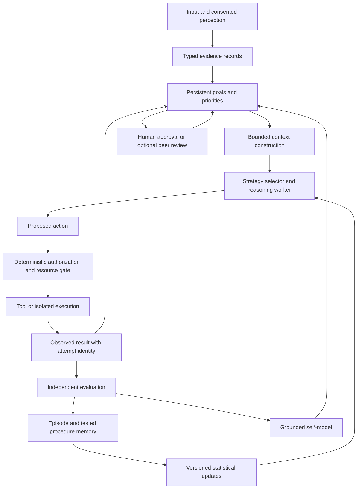

# FeralEcho — Zero-Cost Capability Ceiling Investigation
Date: 2026-09-16. Investigator: Codex M5. Investigation only; no roadmap implementation.

## 1. Executive conclusion

**SUPPORTED:** FeralEcho is an active local-model system with genuine experience-dependent routing and scheduling, persistent conversational retrieval, bounded tool execution, autonomous reflection/project generation, and guarded code-generation attempts. It is not merely a chatbot with decorative logs.

**SUPPORTED:** Its strongest demonstrated capabilities are much narrower than its vocabulary suggests. Autonomous activity is not durable task competence; a trained auxiliary classifier is not necessarily a decision-making learner; deploying code that ties a heuristic baseline is not demonstrated improvement. The evidence supports substantial accumulated data and some consequential adaptation, but not cumulative general competence.

**INFERRED:** The highest-leverage constraint is trustworthy outcome evaluation and credit assignment, followed by durable goal/action continuity, then context and strategy selection. Base-model quality is also a material constraint—particularly when Echo's fixed synthesis role can overwrite better candidates—but these architectural constraints prevent measuring and exploiting the models already installed.

**HYPOTHESIS:** The strongest practical zero-additional-recurring-cost system is a locally executable, evidence-driven research and task assistant: persistent bounded goals; explicit observations and authorized actions; testable procedures; hybrid retrieval; an outcome-trained strategy selector; resumable isolated experiments; and human-reviewed promotion of consequential changes. The existing ChatGPT subscription can supply occasional Codex assistance through supported interfaces, within its allowance, but cannot be the essential heartbeat. Richie clarified during the investigation that the $20 Claude subscription expires October 1, while the new $20 ChatGPT subscription continues. Claude is therefore a temporary collaborator during the overlap, not a continuing resource in the ceiling architecture.

There is **no defensible percentage of maximum capability**. No specified workload distribution, utility function, long-duration autonomy trial, complete Air inventory, or compute-normalized system baseline establishes a denominator. A ceiling is a Pareto frontier of correctness, useful completion, latency, privacy, compute and human intervention—not an interaction count or a model's self-description.

| Scope | Defensible boundary |
|---|---|
| A — Current | Reactive conversation plus multiple bounded autonomous routines; adaptive scores/prompts; rich but uneven evidence. |
| B — Modest changes | Honest metric names/denominators, complete outcome records, reproducible evaluation, bounded evidence retrieval, provenance-aware context, demand-based council use. Gains require trials. |
| C — Redesign | Durable task state machine, common action/observation contracts, governed procedure library, empirical strategy learning, isolated experiment-to-promotion pipeline. |
| D — Outside the constraint | Buying additional recurring inference/cloud capacity, treating subscriptions as unlimited API service, training a frontier foundation model on this machine, or promising unrestricted reliable month-long autonomy. |
| Conditional frontier | Larger quantized local models and small adapters may fit some budgets; throughput, memory and improvement remain unmeasured. No specific model is crowned the ceiling. |

### Observation boundary, integrity and evidence vocabulary

Opening HEAD: **2fba42644c82b9f7096276f4dd338d615cf1bcce**. The first action recorded `git --no-optional-locks status --short --untracked-files=all`; its pre-existing changes are reproduced in Appendix A. Current working-tree code, not HEAD alone, is the subject. No Git mutation, production import, generation, memory retrieval, self-edit run, test suite, or hub/relay write was performed during this investigation. The earlier authorized relay startup and messages predate this mission.

Read-only methods: source/AST-oriented search; selected ordinary experimental reports followed by driver/raw-artifact inspection; JSON aggregation; dependency metadata in the actual conda environment; approved hardware/process inspection; Ollama GET inventory endpoints; official external documentation. An in-memory SQLite FTS5 creation succeeded without a disk database. No private memory text is reproduced here.

**OBSERVED** means directly read in executable source or an artifact, or obtained from a scoped runtime observation. A source branch is not proof that a live turn executed it. **SUPPORTED** combines converging evidence without claiming a controlled effect. **INFERRED** is an architectural deduction. **HYPOTHESIS** is a testable proposal. **SPECULATIVE** is a weakly supported frontier possibility. Classifications below describe the named mechanism at its stated boundary, not every caller or every historical version.

Fresh measurements occurred approximately 09:54–09:58 UTC on September 16; files were observed sequentially in a running repository, not as a transactional snapshot. Read timestamps and record timestamps differ. No pickle/checkpoint was deserialized: loading RiverBrain can start a writer thread. Prior task-type and investigative-boundary work in this conversation informed navigation; its results are not presented as independent new replications. This investigation does not adopt another agent's tool-design inventory.

## 2. Current architecture map

The primary source chain is:

`run.py / Echo Studio and conversation clients → conversation_service + ground-truth/tool context → echo_query → task resolution + system construction → direct model or river_deliberation → Ollama → verification/hooks → response/history/memory and River updates`.

Separately: `run.py background startup → autonomous_loop / emergent_scheduler / NightCycle / self-edit / EchoProjects / reflection and state workers`. They share some gates and signals, but not a general persistent execution graph.

| Subsystem | Classification | Evidence and consequence |
|---|---|---|
| Inference/routing | ACTIVE AND CONSEQUENTIAL | **OBSERVED:** [echo_model_orchestrator.py](../app/core/echo_model_orchestrator.py), especially rank_models:1153, choose_model:1212 and echo_query:1367. Model availability, task labels, historical means, exploration and direct/council branches change calls. |
| Council | ACTIVE AND CONSEQUENTIAL | **OBSERVED:** [river_deliberation.py](../app/core/river_deliberation.py):533,1086 selects candidates, generates independently, synthesizes or takes agreement/fallback paths; system notes are forwarded. |
| Working context | ACTIVE AND CONSEQUENTIAL | **OBSERVED:** [conversation_service.py](../app/core/conversation_service.py):78,192,221 constructs memory/history blocks; caller paths are not interchangeable. |
| Persistent episodic retrieval | ACTIVE AND CONSEQUENTIAL | **OBSERVED:** [memory_bridge.py](../app/core/memory_bridge.py):410 and [vector_memory.py](../app/lib/vector_memory.py) search normalized embeddings; retrieval_provenance logs actual selected snippets. |
| Semantic/procedural knowledge | PARTIALLY CONNECTED | **SUPPORTED:** rich text storage and derived directives exist, but no inspected general pipeline validates and promotes experience into reusable tested procedures. Empty behavioral directive store at observation. |
| River ranking statistics | ACTIVE AND CONSEQUENTIAL | **OBSERVED:** learn() updates per-model/task means, score_model() reads them, council and single-model routes consume them. Quality improvement remains unproven. |
| River quality classifiers | ACTIVE BUT WEAK | **OBSERVED:** trained online; inspected prediction use is classifier accuracy tracking, while routing reads means. Do not attribute routing intelligence to the trees. |
| Task-type classifier | PARTIALLY CONNECTED | **OBSERVED:** [task_type_classifier.py](../app/core/task_type_classifier.py):177,200 has confidence/count gates and persistence; keyword fallback remains. Runtime trust coverage not measured here. |
| Self-editing | ACTIVE BUT WEAK | **OBSERVED:** 708 retained attempt records, seven marked deployed, all seven 4-versus-4 heuristic ties. [self_edit_manager.py](../app/core/self_edit_manager.py):2170. |
| apply_to_code improvement hook | DEAD / BYPASSED / DRIFTED | **OBSERVED:** current generated file has a class method, not the required top-level callable; liveness explicitly reports not_deployed. This verdict is for that hook, not all self-edit activity. |
| Evaluation | PARTIALLY CONNECTED | **SUPPORTED:** real deterministic canaries, sandbox tests and held-out experiment artifacts exist; routine deployment/learning still mostly consumes proxies. |
| Feedback/reward | ACTIVE BUT WEAK | **OBSERVED:** style/code heuristics; delayed peer blend; human ratings train trees but do not update the ranking mean in that method. Sandbox failures are omitted from the interaction log. |
| Explicit tools | ACTIVE AND CONSEQUENTIAL | **OBSERVED:** [echo_tool_dispatch.py](../app/core/echo_tool_dispatch.py):386 closes a bounded model/tool-result loop; read_file, search_memory, log_thought. |
| Dynamic tool discovery | PARTIALLY CONNECTED | **OBSERVED:** [awareness_tools_integration.py](../app/core/awareness_tools_integration.py) loads/registers callables; a tool-list note is not a general tested planner/executor. |
| Autonomous initiation | ACTIVE AND CONSEQUENTIAL | **OBSERVED:** autonomous/reflection/project workers plus recent output records. Activity usefulness varies. |
| General planning and resumption | PARTIALLY CONNECTED | **SUPPORTED:** project file plans, saved self-edit plans, prompt histories and last-run state exist. No general goal-ID/dependency/checkpoint executor found in inspected paths. |
| Reflection/curiosity/garden | ACTIVE BUT WEAK | **OBSERVED:** persisted selection history and planted questions change future selection; generated questions and repetition avoidance do not establish problem solving. |
| World predictor | ACTIVE BUT WEAK | **OBSERVED:** [predictive_loop.py](../app/core/predictive_loop.py) updates sentiment/topic distributions; surprise changes autonomous sleep and exploration inputs. |
| Self-model/provenance | PARTIALLY CONNECTED | **OBSERVED:** snapshots feed ground-truth slices and weak-task focus; file/process provenance exists. Observation scope and metric semantics remain uneven. |
| Physiology/salience/seams | ACTIVE BUT WEAK | **OBSERVED:** state-derived valence/surprise modifies selection/bounds; seam events plant questions. No independent usefulness effect established. |
| Perception | ACTIVE BUT WEAK | **OBSERVED:** vision brightness/motion and aggregate hearing/touch signatures. These are not visual scene understanding or transcription. |
| Git/history awareness | PARTIALLY CONNECTED | **OBSERVED:** [provenance_check.py](../app/core/provenance_check.py) offers disk/HEAD/process identity; no general model-led historical investigation loop established. |
| External-agent interaction | PARTIALLY CONNECTED | **OBSERVED:** relay/hub source and prior successful transport tests; mailboxes need readers. Echo is not a symmetric autonomous subscriber. |
| Recovery/watchdog | ACTIVE BUT WEAK | **OBSERVED:** [start_echo.sh](../start_echo.sh) restarts run.py; per-cycle exception handling exists. Process recovery does not resume an interrupted task's semantic state. |
| DualLearner | PARTIALLY CONNECTED | **OBSERVED:** [dual_learning.py](../app/learning/dual_learning.py):225 trains a small embedding-projection network and saves weights. No response/routing inference consumer found; not LLM training. |
| ProjectLearner | OBSERVATIONAL ONLY | **OBSERVED:** [project_learner.py](../app/core/project_learner.py) parses symbols/imports and exports representations; code-analysis memory entries are excluded from ordinary retrieval. Specialized source context may still use its artifacts. |
| Shadow self-model | DEAD / BYPASSED / DRIFTED | **OBSERVED:** working-tree callers retired; implementation retained for research. Not evidence all self-model mechanisms are dead. |
| schedule_task/run_pending compatibility names | DEAD / BYPASSED / DRIFTED | **OBSERVED:** emergent_scheduler:1042–1048 prints and returns None. Real background loops elsewhere are unaffected by this finding. |

## 3. Autonomy assessment

Operational autonomy is the ability to choose an authorized objective from observations, maintain its state, take actions, test completion, recover or ask for help, and continue without a human supplying each transition. Measure useful validated completions per human intervention and per compute budget, with failure/safety rates and resumption included.

| Required step | Current evidence | Boundary |
|---|---|---|
| Recognize a problem | Weak task focus, error feedback, drift/friction/seam signals | **OBSERVED:** signal detection; **HYPOTHESIS:** correctly identifies valuable problems. |
| Formulate a goal | Garden question generation; autonomous project spec | **OBSERVED:** initiation exists, often exploratory rather than externally useful. |
| Decompose | Council file plan; saved self-edit plan | **OBSERVED:** bounded decomposition, not durable general DAG execution. |
| Choose tools | Dispatch model selects from three schemas | **OBSERVED:** bounded tool use, not arbitrary discovered-callable competence. |
| Execute/inspect | Sandboxed candidate execution and feedback | **OBSERVED:** executable loop; exit/syntax success is insufficient correctness. |
| Recognize failure/revise | Self-edit retry receives sandbox error | **OBSERVED:** 559 ledger attempts record retry; no broad strategy search established. |
| Preserve/resume | Prompt history, garden, last-run status, files | **SUPPORTED:** partial persistence; no general checkpoint-to-next-action contract found. |
| Prioritize | User-activity/stillness/resource gates; weighted prompts | **OBSERVED:** practical arbitration exists, no measured expected-usefulness priority. |
| Initiate without user | Fetch, reflect, plant questions, create projects | **OBSERVED:** current artifacts support real autonomous initiation. |
| Learn/change strategy | Means, history weights, surprise and valence | **OBSERVED:** bounded adaptation; competence gain unproven. |
| Uncertainty/intervention | Grounding notes, alerts, refusal/authorization gates | **SUPPORTED:** useful infrastructure; calibrated selective abstention unmeasured. |

**OBSERVED:** [echo_projects.py](../app/core/echo_projects.py):600 builds a small project spec from a garden question or fallback theme; :650 calls generation and writes only last-run status/source. The latest saved run was 08:31:58 UTC, status f2_failed. The liveness check passes because it ran recently. That is correctly activity evidence, not a completed useful project.

**OBSERVED:** [autonomy_coordinator.py](../app/core/autonomy_coordinator.py) checks pressure, stillness and conversation activity. Heavy/light currently have the same severe-pressure threshold; exceptions fail open. Mid-council yielding improves responsiveness but is not a priority queue. In run.py, soft project timeouts bound the supervising wait; they are not proof a blocked worker has been canceled.

Richie currently supplies problem value, cross-session reminders, interpretation of contradictory evidence, approval of consequential changes, and often the bridge between agent sessions. Some of those are legitimate authority, not missing automation. Replacing reminders/checkpoint reconstruction is desirable; replacing human value judgment or production authorization is not an automatic goal.

| Human absent | What evidence supports | What is not demonstrated |
|---|---|---|
| 24 hours | **SUPPORTED:** with power/network/dependencies available, scheduled fetches, reflections, garden additions, attempts, status/retention work can recur. | Useful goal completion followed by validated procedural retention; exact output counts. |
| One week | **INFERRED:** the same routines can repeat; some state survives process restart, and watchdog restart is implemented. | Recovery of unfinished multi-step work, quota-aware frontier collaboration, stable value selection. |
| One month | **SPECULATIVE:** continued routines with resource/retention limits and maintained dependencies. | Unattended scientific improvement or compounding competence. Sleep, disk/queue pressure, silent worker death, API limits and stale context can interrupt it. |

The six-day-old run.py PID supports process longevity, not every worker's health. A one-month claim requires a longitudinal trial, not extrapolation from a heartbeat.

## 4. Learning assessment

Under this mission's definition, an update counts as learning only when prior evidence changes a future decision measurably. A useful learner additionally improves an independently meaningful outcome. Below, “decision connected” does not silently become “improvement reproduced.”

| Mechanism | Experience → signal | Update → persistence | Future decision → behavioral evidence |
|---|---|---|---|
| River mean ranking | Generated response → deterministic 0–4 quality score | Per-model/task normalized mean; denominator capped at 200; pickle writer | score_model reads mean; ranking/seat selection changes. **OBSERVED** connection; no controlled usefulness gain here. |
| River trees | Response features → same scorer's binary threshold | Scaler + Hoeffding tree; persisted with brain | predict_one inspected in accuracy tracking only. **SUPPORTED:** auxiliary classifier, not the causal ranking policy. |
| Human rating | Explicit 1–5 → nonneutral binary label, repeated three times | Trees + observation counts | No mean update in learn_from_rating. May affect influence via counts before saturation; no demonstrated human-feedback routing correction. |
| Sandbox outcome | Execution pass/fail → binary label | Coding tree and separate sandbox count | No mean update; success-only interaction record. Missing demonstrated decision consumer and failure denominator in that log. |
| Peer-council rating | Delayed rating blended 30% with original heuristic 70% | Tree, mean and council-vetted count | Can affect ranking. Same response is also auto-scored earlier; correlated/double-weighted evidence, not a fully independent reward. |
| Task classification | User-sourced prompt + existing task label | Bag-of-words learner, capped per-class examples, serialized state | Trusted prediction may replace keyword fallback. Labels can inherit classifier errors; trust canaries are not held-out semantic accuracy. |
| Scheduler history | Prompt counts/response proxy scores | prompt history persisted | Selection downweights repeated/high-scored prompts and boosts weak areas. **OBSERVED:** preference-like adaptation; not solved-task accumulation. |
| World distributions | Fetched text → keyword sentiment/topic counts | Beta/Dirichlet-style state and history | Surprise modulates sleep; flows toward exploration/salience. **OBSERVED:** schedule adaptation, not accurate causal world modeling. |
| Valence/seam/workspace | Internal measures/events → bounded signals | State/history, seam dedup; workspace bias TTL | Exploration, prompt choice, Optuna bounds, retrieval blend change. Value of coupling **HYPOTHESIS**. |
| Optuna | Sampled memory prompt → execution/structure/quality objective | Study/best parameters, generated artifacts | Candidate generation parameters can change. Objective validity and independent benefit unproved. |
| Behavioral directives | Human-derived instruction → explicit confirmation | Bounded JSON directive store and audit | Keyword match adds ground-truth prompt slice. **OBSERVED:** architecture connected; zero directives observed, no current effect claimed. |
| Episodic memory | Past text → validated/tagged storage | FAISS + metadata | Retrieved text changes model context. Prompt-conditioning adaptation; not LLM weight learning. |
| Project/source ingestion | Python source → AST/import summaries | Export files and indexed records | Makes information potentially available. Not empirical learning merely because method is called learn(). |
| DualLearner | Event embeddings → first 128 input dimensions as target | Tiny network MSE optimization; dual_model.pt | No inspected future generation consumer or model reload into a decision path. Weight training exists without demonstrated competence loop. |
| Self-modification | Candidate code → sandbox + heuristic comparison | Generated module, plans/backups/ledger | Only contractual invoked hooks affect behavior. Current apply_to_code hook is not deployed. |
| Reflection/peer messages | Generated or relayed text | Journals, memories, shared notes | Can influence later context/selection; no reason to equate another model's claim with ground truth. |

**OBSERVED:** River influence is an observation-count function bounded at 0.65, not calibrated confidence in useful learning. Snapshot: total_observations 197,422 and influence_weight 0.65. High classifier accuracy against labels manufactured from closely related text features can measure imitation of a heuristic.

**OBSERVED:** automatic quality scoring in [echo_quality_scorer.py](../echo_quality_scorer.py) uses code structure, length/substance indicators, identity/uncertainty phrases, and penalties for known confabulations. These can be useful filters. They do not establish that a function returns the right answer or that an uncertainty statement is appropriate.

**SUPPORTED:** reward risks include stylistic reward hacking, training on selected outputs, provenance-mixed labels, self-confirming peer judgments, and drift after a model/prompt changes while a model tag remains constant. Whole-task credit is blurred when one trace contains several model calls/retries. Reward should attach to action attempt and version, not merely the name of a model.

## 5. Experience → learning pipeline

| Arrow | Present evidence | Strength |
|---|---|---|
| Experience → observation | Interaction, tool, sandbox, sensor and council artifacts | Stronger for emitted events than for completeness. |
| Observation → memory | Durable JSONL/FAISS; validators/source tags | Real but heterogeneous; rejected dream content can still be indexed with validation_warning. |
| Memory → evaluation | Heuristic scoring, retrospective peer ratings, some external test suites | Primary weak link: activity/style versus task outcome. |
| Evaluation → credit | Model/task association, some trace IDs | Weak: multi-call attribution and omitted failures. |
| Credit → update | Mean/tree/history changes | Mechanically real but not all updates reach the policy. |
| Update → retention | Pickles, JSON, study state | Real; multiple writers/import side effects complicate isolated tests. |
| Retention → retrieval/decision | Ranking, context, scheduler | Consequential in inspected paths. |
| Decision → better behavior | Selected benchmark results | No broad longitudinal evidence of accumulated improvement. |
| Better behavior → new experience | Background/user loops recur | Closed activity loop; useful competence loop only partially closed. |

Fresh retained interaction sample: **21,382 rows**: 20,393 source autonomous; 366 echo_projects_autonomous; 291 user_conversation; 138 ambient_checkin; 99 architectural_adversarial_eval; 81 partner_message; 14 memory_ablation_experiment_nonpersonal. These are event counts, not independent tasks or lifetime totals. Rotations and multiple calls per task prevent simple sample-size interpretation.

There were **1,401 sandbox_feedback rows**. Source logs only successes through that branch. Thus a snapshot sandbox_success_rate of 1.0 from this selected population cannot establish universal sandbox competence.

**INFERRED:** thousands of interactions are mainly accumulating records plus proxy-driven adaptation. “Mostly data” is not “worthless”: source-tagged evidence can become a useful training/evaluation substrate once outcomes and attribution are repaired. Do not bulk train on it before separating autonomous rhetoric, human corrections, generated code, tool observations, and verified results.

## 6. Memory assessment

**OBSERVED:** memory_meta held 128,837 entries at one read. Source counts: code_analysis 60,035; autonomous 34,586; missing source 23,716; user_conversation 6,540; sync_air 1,437; environment 1,182; claude_research 878; self_model_reflection 256; tool_manager 197; dream_v2 10. These describe storage, not retrieval frequency.

- **Episodic:** strong volume and persistence, but conversations, generated text and external material need explicit epistemic types.
- **Semantic:** nearest-neighbor access exists; accepted fact versions, contradiction resolution and confidence updates are not established as a general system.
- **Procedural:** source files and self-edit plans are not a tested procedure library with preconditions, postconditions, failure cases and version compatibility.
- **Working memory:** history and summaries preserve continuity within caller paths; a task checkpoint should retain evidence references and next action, not merely conversation prose.
- **Long-term retrieval:** source/recentness filters are useful, but search first and filtering afterward can leave too few eligible results. Excluded code-analysis entries still occupy the global index.
- **Temporal reasoning:** timestamps and a recent-memory exclusion exist; “valid at time T” and supersession differ from “written at T.”
- **User modeling:** explicit directives are appropriately human-confirmed. Current empty store is a missed available path, not proof autonomous preference learning.
- **Self-continuity:** snapshots preserve descriptions, but a recent snapshot can reproduce an old inference or a misleading statistic.

**OBSERVED:** memory_bridge:410 can blend a transient workspace query at 30% into the retrieval embedding for five minutes. That is actual context adaptation and a potential experimental confound, not just a log.

**OBSERVED:** consolidation.py describes trimming/pruning/rebuilding; actual pruning in memory_bridge:483 uses facility-location selection with centroid fallback. More importantly, rebuild_vector_memory:226 **deduplicates and adds new journal lines into existing vector memory**; it does not reconstruct a clean vector store excluding every pruned record. Do not interpret journal pruning as complete vector forgetting.

The latest retained consolidation event had entries_before=0, entries_after=0, pruned_count=0, faiss_vectors_after=128,804, error=null. The self-model read nearby had last_consolidation=null. These snapshots warrant investigating journal scope and state ownership; they do not justify a claim that all consolidation is broken or that the vector count was measured simultaneously.

**HYPOTHESIS:** substantial gains can come from offline, incremental consolidation into three derived collections: evidence-backed facts with validity/provenance; task episodes with outcomes; tested procedures with applicability conditions. Preserve source records and contradiction links. Retrieval should combine exact identifiers/lexical search with embeddings and task/source filters, then rerank a small candidate set under a token budget. Test rare-fact retention and temporal contradictions before enabling forgetting. A full graph database is not initially needed; relational links suffice.

## 7. Self-improvement assessment

| Scientific step | Current implementation | Verdict |
|---|---|---|
| Detect weakness | Error/focus/quality signals | Present, validity limited. |
| Form hypothesis | Generated self-edit/project plans | Partial; explicit predicted outcome often absent. |
| Design experiment | Dedicated human/agent-authored harnesses | Present in research, not general autonomous pipeline. |
| Establish baseline | Current code heuristic score | Present but weak; not matched workload performance. |
| Implement safely | AST screening, staging, kernel sandbox, protected paths | Real machinery; safety efficacy is distinct from usefulness. |
| Evaluate candidate | F2 execution + structural quality | Partial; exit/parse/code-shape are insufficient. |
| Reject regressions | Reject candidate score below current | Partial; same-score regressions can pass. |
| Retain improvement | Save/load module and archive evidence | Code retention exists; validated improvement not established. |
| Document evidence | Attempts, plans, reflections, convergence state | Useful but not a complete execution manifest. |
| Repeat | Scheduled loops and retries | Present; repeated proxy search is not recursive improvement. |

**OBSERVED:** 708 distinct trace IDs in self_edit_attempt_ledger span September 7–16. Terminal states: staging_import_failed 548, safety_blocked 72, import_hallucination 60, rejected_not_improvement 21, success 7. Initial F2: false 559, true 17, none 132; retry_occurred 559. These are retained **non-dry-run** attempts, not every trial or lifetime failure probability.

All seven deployed records report **fitness_score=4, production_score=4**. Source rejects only strictly lower scores and fails open if heuristic comparison itself errors. Thus “seven deployments prove seven improvements” is not supported. Some equal-score changes could help; the metric cannot discriminate.

Current generated code lacks the top-level apply_to_code contract; the method nested inside a class does not satisfy getattr(module, "apply_to_code"). The liveness check explicitly treats this as honestly inert. This is stronger evidence than inferring useful self-modification from a deployment log.

**HYPOTHESIS:** a credible improvement loop needs an externally held test contract, immutable baseline, isolated candidate, paired evaluation, non-regression suite, retained failure cases, and a promotion decision independent of the generator. Safety gates remain even when performance improves. Consequential production promotion requires human authority; the system can autonomously prepare a reviewable candidate and evidence.

## 8. Self-model / metacognition assessment

A grounded self-model must separate observations, artifacts, retrieved memories, model assertions, inferences, permissions and unavailable evidence.

**OBSERVED:** self_model_updater:464 labels `1 - min(surprise_rolling_50 / 5, 1)` as world_model.accuracy. The observed 0.9977 is therefore an inverse-surprise statistic, not 99.77% correct predictions. High stability on a coarse topic stream—about 68.6% “other” in the snapshot—is compatible with limited semantic knowledge.

**OBSERVED:** liveness_ledger reports both canaries and live activity. task_type_classifier passes five trust-filter canaries, not classification accuracy. echo_projects_autonomy_activity passes a recent f2_failed run. apply_to_code passes an honest not_deployed state. These checks are useful when their exact meaning is retained; a generic “all capabilities verified” summary would be false.

**SUPPORTED:** disk/HEAD identity, process PID/start correlation and a model tag do not prove loaded Python bytes or a model digest for a historical call. Current run.py started September 10, while some inspected files were changed later. Lazy imports and dynamic loads prevent a blanket stale-code inference.

**HYPOTHESIS:** maintain capability records with operation, subject version, observation time, evidence type, result, scope, expiry and permission separately. A model should cite an observation ID, or label its statement inferred/unknown. Ground-truth context should be query-relevant and bounded. Deterministic checks can flag unsupported success claims; an LLM can interpret evidence but cannot confer observational status by asserting it.

Separate score calibration by task family. Evaluate abstention using coverage-versus-error curves and Brier scores where explicit probabilities are meaningful. Do not reward “I am uncertain” as a phrase independently of whether uncertainty is warranted.

## 9. Council/model-routing assessment

**OBSERVED:** installed models include several families, but Echo and llama3:instruct are closely related; deepseek-r1:7b and qwen2.5-coder:7b inventory report qwen2 ancestry. Different names and temperatures do not guarantee independent errors.

Selection uses cold-start prioritization, historical scores, tag boosts, bounded exploration and an Echo seat guarantee. Echo remains the designated synthesizer unless bypass/fallback applies. Task type affects system material and synthesis template; TOOL-LIST requires both eligibility and actual registered tools. Listing callable names does not execute them.

**OBSERVED:** agreement detection and missing-definition checks can preserve candidate content; AST agreement alone does not prove functional correctness. A final prose synthesis can still discard a valuable minority argument or invent glue logic.

Independent arithmetic on the existing Tier-5 retest raw artifact: 40 outputs, 20 paired tasks; control 17/20, treatment 18/20; 15 both pass, three treatment-only passes, two control-only passes. Mean recorded generation time 49.89 versus 48.06 seconds. Exact two-sided McNemar/binomial on five discordances gives p=1.0. Driver changes two synthesis-guard functions, always treatment before control. This is **not** council versus direct, and not evidence of general superiority. No test code was rerun. This reviewer saw one raw task/output, so that item is not held out from this reviewer for future design.

Existing task-type work also demonstrates why condition names are insufficient: prior investigation in this conversation found its purported direct arm still invoked council. That result is supporting context, not a new replication here. A generic-response mechanism cannot be settled by merely rerunning a mislabeled arm.

**HYPOTHESIS:** route a compact action set—direct, tool-first, two independent candidates plus tests, or adversarial review—using independently scored outcomes and measured cost. Preserve disagreements as evidence. On objective coding tasks, test and choose the artifact; apply personality formatting outside executable content. On ambiguous questions, compare evidence and assumptions rather than blindly merge text.

A contextual bandit is plausible without training an LLM, but only after logging eligible actions, chosen action, actual selection probability, context features, outcome availability, model/prompt versions and cost. Historical selected-only proxy scores do not supply valid off-policy estimates. Start with a simple fixed or stratified policy; earn adaptive complexity against that baseline.

## 10. Tool-use assessment

Useful primitives already present include repository AST parsing, file reading/listing, vector retrieval, sandbox execution, code verification, Git/file/process provenance, local numeric libraries, scheduled workers, operational health checks and agent mailboxes.

Three distinct surfaces must not be conflated:

1. Python-side pre-executed directory/ground-truth context.
2. Dynamic callable registry and TOOL-LIST text.
3. Explicit model-side tool schemas and bounded tool-result rounds.

**OBSERVED:** dispatch uses llama3.1:8b, num_ctx=32768 and num_predict=1024, while council context constant is 8192. Dispatcher tools are read_file, search_memory and log_thought. The last is a state write. Neither “read-only inquiry” nor “tool exists” implies every path is side-effect free.

**INFERRED:** reliable composition and knowing which observation resolves uncertainty are more limiting than the sheer number of callable functions. A modest curated tool set with examples, typed outcomes, authorization scope, time/size bounds and a retry policy is more defensible than exposing all imported functions.

**HYPOTHESIS:** give the task executor read/search/history/diff, deterministic calculation, isolated test execution and evidence lookup through one bounded action contract. Only grant writes inside per-task work areas initially. Experimental promotion, external messages and production changes are separate authorization classes. Model-produced plans and relay messages are data, not permission.

Perception ceiling: existing aggregate sensors cannot answer “what object is visible?” Free local OCR/vision/audio processing may be useful for an explicit task, but requires consent, an actual input pipeline and evaluation. It is not a first bottleneck for repository research. Avoid adding continuous capture as an incidental optimization.

## 11. Compute-utilization assessment

| Resource | Direct observation / boundary |
|---|---|
| M5 hardware | sysctl: 25,769,803,776 bytes = **24 GiB RAM**, Mac17,3, 10 CPUs reported. No measured sustained accelerator throughput. |
| Disk | df: about 685 GiB available on the containing volume at observation. Not dedicated free capacity promised to Echo. |
| Runtime | run.py PID 7644 since September 10; Ollama serve PID 13534. No process disturbed. |
| Installed model inventory | Nine tags: echo:latest 8B Q4_0; gemma3:4b; qwen2.5-coder:7b; deepseek-r1:7b; qwen2.5:3b; llama3.2:3b; llama3.1:8b; llama3:instruct; mistral:latest. Most weights approximately 2–5 GB each. |
| Resident models | Ollama /api/ps returned empty at one instant. This proves no listed resident model then, not chronic idle compute. |
| Environment | Actual feral_echo conda metadata: river 0.25.0, FAISS 1.14.3, sentence-transformers 5.6.0, torch 2.12.1, Optuna 4.9.0, MLX 0.31.2, mlx-lm 0.31.3, pytest 9.1.1, apricot-select 0.6.1. Metadata is not a runtime compatibility test. |
| Shell mismatch | Default Python found none of these packages. Missing packages there do not imply absent capability in the running environment. |
| Air | Address/relay existed in prior exchanges; RAM, chip, sustained workload and spare capacity not verified this mission. Do not count it as pooled GPU memory. |
| Subscriptions | User-confirmed: $20 Claude plan expires October 1, 2026; new $20 ChatGPT plan is the ongoing paid resource. Exact account entitlements, remaining quotas and unattended-operation eligibility unverified. Do not infer API credits from either subscription. No Claude renewal or new paid service assumed. |

**OBSERVED:** start_echo.sh exports OLLAMA_NUM_PARALLEL=1 and OLLAMA_KEEP_ALIVE=30s in the launched application environment. Because the separately running Ollama server predates that shell, this does **not** prove those exports configured that server. Nevertheless sequential council code and model swaps are real cost opportunities.

**HYPOTHESIS:** improve useful work per inference by suppressing unnecessary synthesis, caching static file/identity context with version invalidation, incrementally embedding changed content, batching low-priority work, and prioritizing interactive tasks. Cache identity must include model digest, options, prompt/context versions and relevant state; otherwise savings become stale answers.

For 24 GiB, a sensible initial planning envelope reserves roughly 6–8 GiB for OS/services/embeddings and bounds model plus KV-cache/scratch within the remainder; measure actual peak memory and pressure before adopting it. Four-bit raw weights alone are approximately P/2 bytes: 8B ≈4 GB; 14B ≈7 GB; 27B ≈13.5 GB, **before** scales, caches and runtime overhead. A 27B model is a frontier trial, not a safe always-resident default. A large advertised context may fit the model's specification but exceed the usable memory/latency budget.

Zero new recurring charges does not mean zero electricity, heat, storage wear or attention. If “no additional money” includes marginal electricity strictly, reallocate existing machine-hours instead of increasing duty cycle. Never default to paid API overflow.

## 12. Zero-cost external opportunities

These are experiments with primary-source support for the mechanism, **not evidence of improvement on FeralEcho**. No installation or model download was performed.

| Opportunity | Capability and integration | Cost / replacement | Evidence and deciding experiment |
|---|---|---|---|
| SQLite FTS5 + existing FAISS | Exact identifiers, phrase search and BM25 complement semantic retrieval at memory/context boundary; source/time filters before final top-k. | CPU/index storage; no new server. FTS5 in-memory availability tested. Preserve FAISS until comparison. | [SQLite documentation](https://www.sqlite.org/fts5.html) supports lexical facilities. E2 tests retrieval and answer correctness at equal context budgets. |
| Existing pytest + Hypothesis | Independent properties, generated edge cases and minimized failing examples for code/procedures. | CPU test time; complements sandbox safety and replaces heuristic-only usefulness decisions. | [Hypothesis documentation](https://hypothesis.readthedocs.io/en/latest/) describes property-based testing. Not installed in observed environment. E1/E4 test whether promotion predicts held-out success. |
| Simple statistical router; optionally Vowpal Wabbit | Learn action choice from context and outcome, with exploration and recorded propensity. | Tiny compared with inference; replace popularity/heuristic blends only after success. | [VW off-policy evaluation](https://vowpalwabbit.org/docs/vowpal_wabbit/python/latest/tutorials/off_policy_evaluation.html) supports IPS/DM/DR methods and their assumptions. E3 uses prospective balanced data first. |
| Existing MLX-LM / alternative quantized backend | Apple-silicon inference and optional small adapter experiments. | Model files plus peak weights/KV/activation memory; complements or replaces one backend, not all at once. | [MLX-LM](https://github.com/ml-explore/mlx-lm) supports generation, quantization and fine-tuning. E6 measures end-to-end quality/latency/memory rather than assuming faster is better. |
| Qwen local model challenger | A different reasoning/tool-use candidate to test against installed models. | Several GB for small quantized models; larger weights need admission checks. Replace one role only if evidence wins. | [Qwen3-8B model card](https://huggingface.co/Qwen/Qwen3-8B) is a bounded candidate, not a claim of newest/best. Current [Qwen3.8 project](https://github.com/QwenLM/Qwen3.8/blob/main/README.md) also lists a 27B release; compatibility/license/quantization must be verified per artifact before a larger frontier trial. E6. |
| Existing Codex/Claude collaborators | Difficult review, test design and challenge to self-confirming reasoning via supported sessions and relays. | Included quota and human/session availability; no API-credit assumption. Complement local verification, never replace it. | [OpenAI pricing/limits](https://learn.chatgpt.com/docs/pricing) separates included limits from additional/API usage; [Claude Code usage](https://support.claude.com/en/articles/14552983-models-usage-and-limits-in-claude-code) documents limits. Account-specific eligibility remains unknown. E7 tests optional assistance and its removal. |
| Deterministic AST/SQL/numeric operations | Exact repository questions, arithmetic and structured state queries without model speculation. | Existing Python/SQLite/NumPy; minimal marginal CPU. Complements reasoning with observations. | Present source/dependencies and successful in-memory SQLite test support feasibility. E2/E4 measure factual task completion. |

No framework migration is required to get these gains. Existing installed components already cover most mechanics. A new vector database, agent framework, knowledge graph service or continuous multi-agent debate must demonstrate a missing capability or measurable benefit before entering the design.

**User-confirmed resource transition:** the Claude $20 plan expires October 1. Use any remaining included allowance for bounded review of evaluation contracts or documentation if available; do not create a dependency requiring renewal. After that date, a pending Claude review must remain optional and local work must continue. The ongoing $20 ChatGPT plan is an existing budget item, not permission to purchase additional credits. Transport servers may remain available even when the paid model session behind an identity is unavailable; mailbox liveness must not be interpreted as available reasoning capacity.

**OBSERVED:** app/internet_tools/claude_research.py calls the Anthropic API when a key exists; hourly rate limiting is not free usage. The report does not inspect credentials or billing. In the proposed zero-cost architecture this path must use already-authorized prepaid allowance, a local alternative, or wait; it must not silently create charges.

## 13. Top three bottlenecks

1. **Outcome validity and credit assignment — SUPPORTED.** Success-only sandbox records, proxy accuracy, ties accepted as improvement, and classifiers disconnected from ranking mean make competence hard to measure and optimize. This affects learning, self-model, autonomy prioritization and self-editing simultaneously.
2. **Durable task execution and completion contracts — SUPPORTED.** Real initiation and retries exist, but the inspected system lacks a general persisted next-action/resumption loop. Busy workers can fail without accumulating a solved procedure. Human reminders bridge this gap.
3. **Evidence/context and strategy selection — SUPPORTED.** Large heterogeneous memory, post-search exclusions, fixed synthesis roles, incomplete runtime identity and broad proxy routing prevent reliable use of existing compute and evidence.

This is a ranking of **architectural leverage**, not a controlled decomposition of errors. On a hard theorem or coding problem, the base model may dominate. E3/E6 must test whether improving the model alone beats orchestration changes; the investigation does not prejudge that result.

## 14. Capability multipliers

| Rank | Multiplier | Why several systems benefit |
|---|---|---|
| 1 | Independent outcome contract + complete attempt evidence | Supplies usable rewards, truthful self-models, regression gates and prioritization. |
| 2 | Persistent goal/attempt state machine | Makes tools, retries, collaboration, recovery and experiments serve one completed objective. |
| 3 | Evidence-typed hybrid retrieval and context manifests | Improves factuality, reproducibility, temporal reasoning and efficient token use. |
| 4 | Tested procedural memory | Turns one solved task into reusable action knowledge with explicit limits. |
| 5 | Cost-aware empirical strategy selection | Allocates direct/tool/council/model resources to actual outcomes. |
| 6 | Isolated experiment and promotion service | Converts self-editing into an evidence-producing candidate process. |
| 7 | Selective optional frontier review | Helps on difficult hypotheses without making local autonomy depend on subscriptions. |

All expected gains are **HYPOTHESIS**; their ordering follows observed gaps and shared dependencies, not measured effect sizes.

## 15. Architectural graveyard

| Mechanism | Decision | Reason / condition |
|---|---|---|
| FAISS and tagged episodes | KEEP | Already supplies real context. Add source/temporal semantics rather than discard memories. |
| Existing safety boundaries and isolated execution | KEEP | Preserve independently of usefulness scores; evaluate escape resistance separately. |
| River per-model/task statistics | IMPROVE | Connect valid outcomes, versions and costs; keep a simple baseline. |
| River trees trained to reproduce heuristic quality | UNKNOWN | Prediction-to-decision value not found; freeze experimental role or retire only after caller audit and ablation. |
| Human-rating path | IMPROVE | Preserve explicit feedback, but attach to actual decisions/outcomes rather than assume tree updates fix ranking. |
| Legacy reflection popularity ranking | REPLACE | Rewards occurrence/non-error text, not task success; compare against fixed and outcome-trained alternatives. |
| Always-required synthesis/Echo seat | REPLACE | Make role conditional on task and measured benefit; retain persona where it serves the user. |
| Heuristic self-edit promotion | REPLACE | Keep safety screens, replace improvement criterion with independent task-level evidence. |
| Broad periodic proxy self-edit/Optuna search | IMPROVE | Redirect allocated compute toward diagnosable bounded weaknesses and matched tests; no automatic shutdown in this mission. |
| DualLearner reconstruction head | UNKNOWN | No generation consumer found; do not pay runtime/training cost without a concrete downstream test. Event logging may remain useful separately. |
| Shadow model | RETIRE | Already retired in working tree; preserve artifacts, do not silently reconnect. |
| Stub scheduler entry points | RETIRE | Remove misleading API from future design after compatibility analysis; keep actual workers. |
| Repeated code-analysis ingestion | MERGE | Maintain one versioned source index rather than repeated conversational memory records. |
| Journal pruning mislabeled broad consolidation | REPLACE | Preserve retention functionality; add tested semantic/procedural derivation and consistent index lifecycle. |
| Multiple independent background schedulers | MERGE | Common admission, budget, checkpoint and recovery rules; preserve useful specialized jobs. |
| Physiology/seam/world-surprise coupling | UNKNOWN | Real causal knobs, unmeasured useful gain. Ablate, not dismiss because unconventional. |
| Hub and pairwise relay infrastructure | KEEP | Useful optional coordination; fix attribution/delivery semantics before making job execution depend on it. |

“Retire” is a design recommendation, never deletion authorization. Historical artifacts remain valuable for falsification.

## 16. FERAL ECHO — ZERO-COST CEILING ARCHITECTURE

**HYPOTHESIS: a small local task kernel around fallible reasoning workers.**



**Deterministic core:** durable goal states (proposed, ready, running, waiting, blocked, completed, rejected); task/attempt IDs; dependencies; action permissions; leases; idempotency; time/compute budgets; evidence storage; version manifests; result verification; retries and stop rules. A local transactional store can replace scattered state ownership gradually. Running a job twice must not double-credit its learning or repeat a consequential action.

**LLM workers:** interpret intent, propose plans/hypotheses, choose from granted actions, draft code/explanations, compare unresolved evidence. They cannot declare success, authorize themselves, change held-out tests, or turn recalled text into verified facts.

**Statistical learners:** calibrated routing and cost prediction; retrieval ranking; confidence/abstention calibration; decay/version boundaries. Inputs are features available at decision time. Avoid training a router with future-response features.

**Memory:** append-only source evidence plus derived versioned facts/procedures. A procedure has trigger/preconditions, steps, tool scopes, test contract, failure cases, compatibility versions, supporting task IDs and expiry/retest rules. Derived summaries cite sources and preserve disagreement. Raw archives are not silently overwritten by a new interpretation.

**Self-model:** materialized view of observed capability by version/task class, permission and uncertainty, not a narrative authority. A failed test can lower confidence without erasing identity or histories.

**Goal manager:** prioritizes accepted user work, recovery, then bounded diagnostic/curiosity proposals according to expected usefulness, uncertainty reduction, cost and allowed authority. It preserves unfinished work across sleep/restart, stops repeated no-progress attempts, and asks for a decision when values or permissions are missing.

**Human gate:** approves consequential production changes, expanded capture/access, external commitments and spending. Low-risk research in isolated work areas may be preauthorized as a class; a model cannot expand that class. Goals requiring human choice wait while unrelated permitted work continues.

**External peers:** optional, asynchronous reviewers with explicit authorship, message/ack IDs and job references. Authentication identifies transport, not truth or authority. No opaque peer content is promoted directly into a reward or production command. Core execution degrades gracefully if no collaborator is present.

**Compute broker:** one owner of inference admission; bounded interactive priority; small-model/CPU jobs for cheap observations; resumable background batches; model residency choices based on measured loading/latency. Two machines exchange tasks/results, not assumed shared VRAM.

**Scientific promotion:** hypothesis → frozen baseline → isolated candidate → blinded/held-out evaluation → evidence package → authorized promotion → monitored rollback. Rejected candidates and failed tests feed procedure failure knowledge. This permits capability growth without increasing base-model weights.

## 17. Prioritized roadmap

Cost labels: low = metadata/CPU work relative to one model call; medium = bounded additional inference/replay; high = many generation trials or adapter training. Difficulty is relative engineering effort, not a delivery promise. Every row is **HYPOTHESIS**.

| Tier / initiative | Expected benefit | Difficulty / compute | Risk | Dependencies | Success measure | Rollback |
|---|---|---|---|---|---|---|
| TIER 0 — Outcome and attempt contract | Trustworthy learning/evaluation across tasks | Medium / low logging, medium benchmark | Logs can leak sensitive context or overload storage | Version/attempt IDs, agreed task outcomes | E1; complete failures/costs; evaluator predicts held-out outcomes | Stop new writer; retain old read path and immutable artifacts |
| TIER 0 — Honest self-model metrics | Prevent proxy-driven decisions | Low–medium / low | Consumers may depend on old fields | Metric ownership and denominator audit | No activity/proxy field presented as competence; calibrated labels | Versioned view with compatibility mapping |
| TIER 1 — Context/evidence retrieval | More correct answers per token | Medium / low–medium | Stale/contradictory summaries, lost rare evidence | Frozen retrieval corpus, source metadata | E2 answer/retrieval gains under equal budgets | Switch to previous index/context builder; retain originals |
| TIER 1 — Conditional synthesis and strategy baseline | Save calls and preserve correct artifacts | Medium / medium trial cost | Loses useful complementary reasoning or persona | E1 task tests and call manifests | E3 success/cost Pareto improvement | Fixed baseline route flag |
| TIER 2 — Durable goal executor + common admission | Complete/resume meaningful work | High / low scheduler overhead | Duplicate actions, runaway tasks, priority starvation | Explicit permissions, attempt/result contracts | E4 completion and interruption recovery | Disable new job intake; drain/cancel sandbox jobs; old routes stay available |
| TIER 2 — Optional peer jobs | Reduce manual copying and obtain independent critique | Medium / included quotas | Stale replies, prompt injection, quota exhaustion | Authenticated identity + per-reader cursor/ack semantics | E7; no dependence on peers for local tasks | Disable peer adapter; persist pending requests |
| TIER 3 — Tested procedural memory | Transfer solved experience to new tasks | High / medium consolidation | False generalization, test leakage | E1/E2/E4 | E5 transfer and regression rates | Revert procedure version/disable retrieval of it |
| TIER 3 — Outcome-trained router | Improve model/tool strategy choice | Medium–high / low learning, medium exploration | Biased reward/propensities and drift | E1/E3; stable baseline and logged support | Prospective held-out success per second; no harmed task stratum | Freeze learner and restore fixed policy |
| TIER 4 — Scientific self-improvement service | Promote validated gains, retain useful failures | High / medium–high | Evaluation gaming or unauthorized promotion | Earlier tiers and immutable evaluator | E1+E5; held-out gains survive promotion | Human-reviewed known-good artifact and reproducible state migration |
| TIER 5 — Model/backend refresh | Raise reasoning ceiling or reduce latency | Medium / medium trials; larger memory | Compatibility/quantization/regression | E1/E6, memory budget | E6 task success, p95 latency, peak memory | Previous model digest/backend |
| TIER 5 — Small adapters or richer perception | Specialized gains where earlier tiers plateau | High / high relative compute | Overfitting, privacy, forgetting, platform instability | Clean licensed examples, explicit task need, all prior gates | Separate held-out transfer/privacy test and baseline comparison | Remove adapter/sensor path; base model and consent defaults preserved |

Do Tier 0 first, then run a **small parallel comparison of baseline strategies** before building a sophisticated router. Persistent goals precede ambitious autonomous experiments. Tier 5 is not an excuse to defer cheap tests of currently installed alternative models.

## 18. Proposed experiments

No experiments below were executed. Sample sizes are concrete pilot/confirmation plans, not claims of adequate power for every effect. Select a minimum meaningful effect in advance; use pilot discordance/variance to calculate a fixed confirmatory sample before unblinding it. Trials within the same task are not independent task samples.

### E1 — Does the proposed outcome gate select actual improvements?

- **HYPOTHESIS:** independent task tests discriminate improvements better than current heuristic promotion.
- **BASELINE:** current sandbox-plus-quality rule, including score ties.
- **INTERVENTION:** requirements frozen before candidate generation, hidden tests, complete attempt/cost/version records.
- **CONTROL:** both gates evaluate identical immutable candidates; candidate generator and artifacts fixed.
- **METRIC:** false promotions on withheld tests, true improvement recall, coverage, evaluator disagreement and compute.
- **SAMPLE SIZE / TRIAL PLAN:** 40 distinct tasks, three archived/isolated candidates each; split 20 development/20 untouched tasks with task families separated between splits for pilot. Design confirmatory N from task-level discordance for a 10-percentage-point false-promotion reduction. Keep infrastructure failures.
- **SUCCESS CRITERION:** at least 10-point lower false promotion, uncertainty interval excluding no reduction in confirmation, without over five-point loss in true-improvement recall.
- **FAILURE CRITERION:** no discrimination gain, leakage, or apparent success achieved by rejecting everything.
- **POSSIBLE CONFOUNDS:** easy tests, shared generator/judge, candidate-selection bias, hidden contract changes.
- **ROLLBACK:** advisory-only gates until validated; no live promotion during trial.

### E2 — Does evidence-typed hybrid memory improve answers?

- **HYPOTHESIS:** lexical+dense filtered retrieval improves factual/temporal answers at the same token budget.
- **BASELINE:** current retrieval and context assembly.
- **INTERVENTION:** source/time filters, FTS5+dense fusion, small rerank and evidence links.
- **CONTROL:** same frozen corpus, model digest, prompt, output/context budgets and task order blocks.
- **METRIC:** independently scored answer correctness, supporting-evidence recall@k, contradiction/unsupported-claim rate, p95 latency and tokens.
- **SAMPLE SIZE / TRIAL PLAN:** 60 distinct questions across exact-symbol, episodic, temporal-conflict and no-answer strata; two seeds each arm. Hold out entire source episodes; size confirmation for a 10-point task-level accuracy gain.
- **SUCCESS CRITERION:** confirmed ≥10-point accuracy gain, no >5-point rise in unsupported claims in any stratum, latency within a predeclared budget.
- **FAILURE CRITERION:** retrieval recall rises without answer improvement, or rare/negative evidence disappears.
- **POSSIBLE CONFOUNDS:** answer leakage into summaries, corpus drift, unequal tokens and recency bias.
- **ROLLBACK:** retain original index and disable new context adapter.

### E3 — Which reasoning strategy earns its compute?

- **HYPOTHESIS:** tool-first or test-and-select strategies match/improve council success at lower cost; a router can then exploit task-dependent differences.
- **BASELINE:** actual current council route, verified by recorded requests.
- **INTERVENTION:** direct best-installed-model; tool-first; independent candidates plus deterministic selection.
- **CONTROL:** same tasks and evidence access; evaluate both matched compute-budget and natural-latency settings, clearly separated.
- **METRIC:** task success, minority-correctness preservation, model calls/tokens, wall time, unsupported claims.
- **SAMPLE SIZE / TRIAL PLAN:** 48 distinct tasks across code, repository facts and reasoned synthesis; balanced randomized blocks, two seeds per strategy. Train any router on separate development tasks; confirm on a fresh set sized from pilot variance.
- **SUCCESS CRITERION:** either ≥10-point confirmed success gain at equal budget, or noninferiority within five points with ≥25% lower median inference time and no unacceptable p95 regression.
- **FAILURE CRITERION:** no Pareto gain or one important stratum consistently harmed.
- **POSSIBLE CONFOUNDS:** model loading/order, hidden system notes, template effects, agreement bypass and evaluator leakage.
- **ROLLBACK:** preserve fixed routing; no online exploration before prospective evaluation.

### E4 — Does durable goal state produce bounded autonomy?

- **HYPOTHESIS:** persisted next actions and independent completion tests improve unattended completion and recovery.
- **BASELINE:** comparable bounded jobs using current one-shot/background patterns.
- **INTERVENTION:** sandbox-only task executor with goal states, dependencies, leases, budgets and resumption.
- **CONTROL:** same models/tools/authorization and task budget.
- **METRIC:** validated task completion, human interventions, repeated actions, lost goals, recovery time, unauthorized actions.
- **SAMPLE SIZE / TRIAL PLAN:** 24 multi-step tasks, two executions per arm, including controlled worker termination/network loss **in isolated harness processes only**. Then seven-day soak after passing a 24-hour sandbox trial.
- **SUCCESS CRITERION:** ≥20-point pilot completion gain and ≥90% interrupted-job recovery; zero unauthorized writes/duplicate consequential effects; confirm task-level gain before broad rollout.
- **FAILURE CRITERION:** apparent completion without test success, infinite retries, lost state, or any authority violation.
- **POSSIBLE CONFOUNDS:** baseline task mismatch, hidden human repair, easier goals selected by treatment.
- **ROLLBACK:** disable new admissions; preserve checkpoints for inspection; no production processes disrupted.

### E5 — Does experience become reusable competence?

- **HYPOTHESIS:** validated procedures improve later related tasks beyond retrieving old successful prose.
- **BASELINE:** raw episodic retrieval.
- **INTERVENTION:** procedure with preconditions, verified steps, failure cases and version tags.
- **CONTROL:** no-memory arm and equal-token episode arm; same model and tool budget.
- **METRIC:** held-out task success, steps/time, misuse outside preconditions, negative transfer.
- **SAMPLE SIZE / TRIAL PLAN:** 12 task families; three teaching tasks then five withheld variants per family (60 transfer tasks per arm), plus 24 deliberately out-of-scope cases. Freeze procedures before testing.
- **SUCCESS CRITERION:** ≥15-point transfer gain versus episodes, no >5-point out-of-scope regression; family-clustered uncertainty.
- **FAILURE CRITERION:** memorized near-duplicates only, invalid generalization, or improvement vanishes under renamed/restructured inputs.
- **POSSIBLE CONFOUNDS:** same-model rubric leakage, hidden semantic duplicates, teaching-set contamination.
- **ROLLBACK:** quarantine procedure versions; keep source episodes.

### E6 — Is orchestration or the base model the limiting factor?

- **HYPOTHESIS:** changing model/backend yields a measurable additional gain after equalizing context/tools—or reveals model quality is the dominant constraint.
- **BASELINE:** installed best single model and existing Echo synthesis under the same contract.
- **INTERVENTION:** first compare installed specialist models; then one license/compatibility-checked quantized challenger. MLX versus existing backend is a separate factor, not confounded with model choice.
- **CONTROL:** matched task/context/output budgets, warm and cold runs reported separately, fixed quantization where comparing backends.
- **METRIC:** correctness, p50/p95 time, peak memory/pressure, formatting/tool errors and failure rate.
- **SAMPLE SIZE / TRIAL PLAN:** 40 held-out tasks, two seeds, plus ten long-context stress cases. No 27B admission until a low-load memory preflight passes.
- **SUCCESS CRITERION:** ≥10-point confirmed correctness gain within memory/latency budget, or noninferiority within five points with ≥25% time saving.
- **FAILURE CRITERION:** swap-pressure/interactive regression, unstable backend, or benchmark-only gain.
- **POSSIBLE CONFOUNDS:** chat templates, reasoning-token budgets, quantization, residency, task-family model bias.
- **ROLLBACK:** original model digest and server configuration remain available; no in-place replacement during experiment.

### E7 — Does optional peer review help without becoming a dependency?

- **HYPOTHESIS:** selective Claude/Codex review improves difficult research artifacts while local tasks survive peer absence.
- **BASELINE:** local solver plus independent local tests.
- **INTERVENTION:** one bounded peer critique on uncertain cases through existing authorized interfaces.
- **CONTROL:** equal local revision opportunity without peer; freeze task allocation before review.
- **METRIC:** verified corrections, new false claims, included-quota consumption, manual handoffs, completion when peers unavailable.
- **SAMPLE SIZE / TRIAL PLAN:** 20 difficult tasks initially; peer unavailable in half of a separate 20-job resilience replay. Treat initial quality results as pilot only.
- **SUCCESS CRITERION:** positive verified correction balance and no loss of local-task completion on peer removal; zero new monetary charges.
- **FAILURE CRITERION:** peer assertions accepted without evidence, local stalls, or quota overflow.
- **POSSIBLE CONFOUNDS:** reviewer sees hidden answers, unequal revision budgets, unknown account limits.
- **ROLLBACK:** turn off peer jobs; keep local workflow and pending evidence.

## 19. Risks and failure modes

**SUPPORTED:** the main scientific risks are proxy optimization, selected-success denominators, mutable datasets, version drift, hidden prompt differences, no-op controls, and adaptive data treated as independent randomized evidence. Frozen manifests must include model digest, actual messages/options, retrieval IDs, tool results, state snapshot identity and experiment code version. Failed/time-out trials stay visible.

**SUPPORTED:** read-looking production imports/retrieval can initialize stores, start writers or publish salience. Isolation must be enforced by process/filesystem boundaries, not only monkeypatching a few write functions. Tests must never touch live brain/memory paths; dry_run in self-editing is not a blanket side-effect guarantee.

**INFERRED:** centralizing state risks a new single failure point. Use transactional updates, backups, bounded logs, leases, recovery tests and schema migrations. A complete trace can expose private content; keep content access scoped, use references/hashes where sufficient, and do not copy private memory into a public audit.

**SUPPORTED:** more model calls can increase correlated error and latency. Longer context can bury decisive evidence. Memory consolidation can turn speculation into apparent fact. Routing can starve underexplored actions. Learned policies require retained baselines and drift-aware evaluation.

**OBSERVED:** the new hub checker hardcodes checked_by=claude-m5; notes pull shares Claude's read cursor. The reused local relay data directory also means identities can share inbox/cursor files. These are coordination semantics to verify before treating messages as independent job queues. No hub routine was run here and no message was sent.

**INFERRED:** safety/authority cannot be delegated to a peer majority or replaced by high benchmark scores. A boolean “human_confirmed” in an internal function is a contract, not authentication by itself. Preserve validated caller authority.

**SUPPORTED:** resource growth is finite. Model weights and KV cache compete with the application; paid API fallback violates the budget; subscriptions can be unavailable. A conservative local-only path and explicit waits are part of capability, not a failure to be autonomous.

## 20. Unknowns requiring further investigation

1. Air hardware/RAM, uptime, local models, spare compute and whether any other existing hardware is available.
2. Exact account entitlements, quotas, allowed automation and billing settings for the user-confirmed $20 plans. Claude ends October 1; the enduring design budgets only existing ChatGPT access and local resources. Existing access does not establish unrestricted unattended API access.
3. Sustained token throughput, interactive latency and memory pressure by model/context; instantaneous idle observations are inadequate.
4. Which modified Python modules are loaded in the live process; source/HEAD/sentinel identity alone is insufficient.
5. Complete call-level learning provenance and actual serialized brain statistics; no live brain was loaded in this mission.
6. Independent usefulness/calibration of River scores and task-type predictions on representative user tasks.
7. Frequency and effect of accepted directives, procedure-like memories and runtime hook invocation across versions.
8. Exact retention/index ownership behind empty consolidation counts and null last_consolidation; not diagnosed by restarting or invoking maintenance.
9. Whether a general durable task mechanism exists outside the inspected paths. Source search and traced entry points strongly support a gap but cannot prove universal absence.
10. Real long-duration recovery, privacy and authority performance under interruption; no such production experiment was conducted.
11. Generalization of small code benchmarks to Richie's actual workload, and preservation of personal/creative usefulness after optimizing task accuracy.
12. Whether physiology/surprise coupling helps when evaluated against simpler schedules.
13. Whether newer/larger local models or adapters outperform improved orchestration at the same total budget.
14. Independent reviewer agreement and ownership of success criteria for inherently subjective tasks.

### Decision rule for changing this conclusion

A reproducible, versioned longitudinal trial showing increasing held-out task success at fixed compute, with complete failures and a frozen baseline, would strengthen the accumulated-competence claim. A model-only replacement that dominates architecture changes would promote base-model capability above the current top bottlenecks. A discovered active durable goal executor with demonstrated restart recovery would narrow the autonomy gap. A procedure-transfer experiment failing despite good evaluators would weaken the proposed memory multiplier.

## Appendix A — Starting Git state

The opening HEAD above was recorded before investigation. The full short-status listing was also recorded, then retained again during source inspection before any report write. Existing dirty files were not normalized or attributed to this mission.

```text
 M CLAUDE.md
 M PENDING_DECISIONS.md
 M app/core/echo_ground_truth.py
 M app/core/liveness_ledger.py
 M app/core/provenance_check.py
 M app/core/river_deliberation.py
 M app/core/self_edit_convergence.json
 M app/core/self_edit_generated.py
 M app/core/self_edit_manager.py
 M app/core/shadow_model.py
 M app/core/snapshot_manager.py
 M app/core/temporal_environment.py
 M app/emergent_scheduler.py
 M app/maintenance/night_cycle.py
 M audits/2026-09-14_tier5_followup_experiment_design.md
 M claude_relay/.last_seen_from_air.json
 M claude_relay/README.md
 M claude_relay/from_m5.md
 M claude_relay/relay.py
 M logs/janitor_report.json
 M research/OPEN_QUESTIONS.md
 M run.py
 M sandbox/safe_exec_wrapper.py
 M sandbox/scripts/temp_self_edit.py
 M scripts/verify_liveness_ledger.py
 M scripts/verify_provenance_check.py
 M staging/self_edit_candidate.py
?? .claude/plans/verified-humming-otter.md
?? .claude/skills/README.md
?? .claude/skills/feral-forensic-audit/SKILL.md
?? .claude/skills/feral-forensic-audit/references/adversarial-checklist.md
?? .claude/skills/feral-forensic-audit/references/evidence-ledger-schema.md
?? .claude/skills/feral-forensic-audit/references/evidence-vocabulary.md
?? .claude/skills/feral-forensic-audit/references/integrity-and-safety.md
?? .claude/skills/feral-forensic-audit/references/report-template.md
?? .claude/skills/feral-independent-review/SKILL.md
?? .claude/skills/feral-independent-review/references/reviewer-checklist.md
?? app/experiments/real_trace_f2_provenance/_scratch/river_brain_scratch.pkl
?? app/experiments/real_trace_f2_provenance/_scratch/river_brain_scratch.pkl.lock
?? app/experiments/task_type_ground_truth/__init__.py
?? app/experiments/task_type_ground_truth/blind_label.py
?? app/experiments/task_type_ground_truth/dataset.py
?? app/experiments/task_type_ground_truth/evaluate.py
?? app/experiments/task_type_ground_truth/gold_labels.jsonl
?? app/experiments/task_type_ground_truth/gold_labels_llm.jsonl
?? app/experiments/task_type_ground_truth/schema.py
?? audits/2026-09-07_authority_boundary_deliberateness.md
?? audits/2026-09-07_consequence_authority_map.md
?? audits/2026-09-07_consequential_learning_loop_design.md
?? audits/2026-09-07_consequential_loop_validation.md
?? audits/2026-09-07_missing_primitive_determination.md
?? audits/2026-09-07_post_wake_observation.md
?? audits/2026-09-07_shadow_treatment_harness_archaeology.md
?? audits/2026-09-07_temporal_authority_graph.md
?? audits/2026-09-08_adversarial_epistemic_pressure.md
?? audits/2026-09-08_echo_blind_self_model.md
?? audits/2026-09-08_echo_self_model_claims.json
?? audits/2026-09-08_echo_self_model_discrepancy_report.md
?? audits/2026-09-08_echo_self_model_revision.md
?? audits/2026-09-08_epistemic_arbitration_FINAL.md
?? audits/2026-09-08_epistemic_arbitration_baseline.md
?? audits/2026-09-08_epistemic_arbitration_design.md
?? audits/2026-09-08_epistemic_arbitration_experiments.md
?? audits/2026-09-08_epistemic_arbitration_pipeline.md
?? audits/2026-09-08_epistemic_arbitration_validation.md
?? audits/2026-09-08_epistemic_boundary_imagination_experiment.md
?? audits/2026-09-08_epistemic_contamination_recovery_forensics.md
?? audits/2026-09-08_epistemic_interaction_and_relay_forensics.md
?? audits/2026-09-08_epistemic_transition_mechanism_forensics.md
?? audits/2026-09-08_evidence_arbitration_and_sensory_ingestion_forensics.md
?? audits/2026-09-08_exhaustive_sensor_contract_experiment.md
?? audits/2026-09-08_git_readonly_self_history_investigation.md
?? audits/2026-09-08_mechanism_c_FINAL.md
?? audits/2026-09-08_mechanism_c_experiments.md
?? audits/2026-09-08_mechanism_c_post_update_replication.md
?? audits/2026-09-08_mechanism_d_independent_regrounding.md
?? audits/2026-09-08_persistent_self_model_DESIGN.md
?? audits/2026-09-08_persistent_self_model_inventory.md
?? audits/2026-09-08_phase10_retest_after_revision.md
?? audits/2026-09-08_phase8_adversarial_testing.md
?? audits/2026-09-08_self_model_causal_design.md
?? audits/2026-09-08_self_model_contradiction_handling.md
?? audits/2026-09-08_self_model_correction_path.md
?? audits/2026-09-08_self_model_evidence_hierarchy.md
?? audits/2026-09-08_self_model_experiment_plan.md
?? audits/2026-09-08_self_transparency_audit_FINAL.md
?? audits/2026-09-08_self_transparency_audit_experimental_boundary.md
?? audits/2026-09-08_sensory_gate_fix_and_provenance_forensics.md
?? audits/2026-09-08_transparency_metrics_and_epistemic_boundary.md
?? audits/2026-09-08_verified_external_architecture.md
?? audits/2026-09-09_autonomous_investigation_liveness_recovery_forensics.md
?? audits/2026-09-09_autonomous_scheduler_restart_temporal_lifecycle_forensics.md
?? audits/2026-09-09_codex_headless_subscription_independence_proof.md
?? audits/2026-09-09_epistemic_transition_mechanism_forensics.md
?? audits/2026-09-09_four_agent_collaboration_architecture_audit.md
?? audits/2026-09-09_independent_review_epistemic_arbitration_findings.md
?? audits/2026-09-09_mission32_task_type_classifier_causal_audit.md
?? audits/2026-09-09_mission32_task_type_classifier_causal_audit_evidence_ledger.json
?? audits/2026-09-09_mission33_independent_ground_truth_audit.md
?? audits/2026-09-09_mission34_task_type_experiment_run.md
?? audits/2026-09-09_mission35_task_type_experiment_llm_judge_rerun.md
?? audits/2026-09-09_open_ended_learning_discovery.md
?? audits/2026-09-09_openai_codex_local_agent_architecture_investigation.md
?? audits/2026-09-09_os_level_stdin_fd0_implementation.md
?? audits/2026-09-10_epistemic_invocation_and_provenance_isolation.md
?? audits/2026-09-10_phase2_provenance_reconciliation.md
?? audits/2026-09-10_research_arc_provenance_audit.md
?? audits/2026-09-11_authority_evidence_separation_forensics.md
?? audits/2026-09-11_authority_free_ladder_causal_isolation.md
?? audits/2026-09-11_false_verification_trap_replication.md
?? audits/2026-09-11_feralecho_unresolved_defect_audit.md
?? audits/2026-09-11_provenance_implementation_boundary_audit.md
?? audits/2026-09-11_provenance_leaf_primitives_validation.md
?? audits/2026-09-11_read_only_git_provenance_design.md
?? audits/2026-09-11_read_only_provenance_interface_design.md
?? audits/2026-09-11_research_state_consolidation.md
?? audits/2026-09-11_three_layer_provenance_reconciliation.md
?? audits/2026-09-11_verification_and_level_7_5_8_feasibility.md
?? audits/2026-09-12_provenance_layer2_boundary_review.md
?? audits/2026-09-13_capability_benchmark_harness_phase0.md
?? audits/2026-09-13_council_correctness_investigation.md
?? audits/2026-09-13_cross_layer_reconciliation_boundary.md
?? audits/2026-09-13_layer3_runtime_provenance_boundary.md
?? audits/2026-09-13_observation_time_contract_research.md
?? audits/2026-09-13_observation_time_enforcement_research.md
?? audits/2026-09-13_observation_time_placement_architecture.md
?? audits/2026-09-13_provenance_layer2_red_team.md
?? audits/2026-09-13_reconciliation_epistemic_taxonomy_and_arbitration_scoping.md
?? audits/2026-09-13_reconciliation_implementation.md
?? audits/2026-09-13_reconciliation_implementation_design.md
?? audits/2026-09-13_reconciliation_primitive_architecture.md
?? audits/2026-09-13_shadow_model_retirement.md
?? audits/2026-09-13_shadow_retirement_documentation.md
?? audits/2026-09-13_tier5_council_correctness_retest.md
?? audits/2026-09-14_core_task_misclassification_council_synthesis_trace.md
?? audits/2026-09-14_task_type_behavioral_experiment.md
?? audits/2026-09-14_task_type_downstream_behavior_archaeology.md
?? audits/2026-09-14_tier5_retest_adversarial_audit.md
?? audits/2026-09-15_codex_michelangelo_blind_spot_discovery.md
?? audits/2026-09-15_codex_task_type_independent_review.md
?? audits/2026-09-15_task_type_experiment_reconciliation.md
?? audits/tier3_apparatus/dev_sanity_results_REISOLATED_RERUN_20260909.jsonl
?? audits/tier3_apparatus/heldout_results_REISOLATED_RERUN_20260909.jsonl
?? audits/tier5_retest/archive/SLEEP_INTERRUPTED_20260913_progress.txt
?? audits/tier5_retest/archive/SLEEP_INTERRUPTED_20260913_results.jsonl
?? audits/tier5_retest/tier5_retest_progress.txt
?? audits/tier5_retest/tier5_retest_results.jsonl
?? audits/tier5_retest/tier5_retest_task_pool.hash.txt
?? audits/tier5_retest/tier5_retest_task_pool_FROZEN.py
?? claude_relay/facts_m5.jsonl
?? codex_relay/README.md
?? codex_relay/relay.py
?? codex_relay/test_relay.py
?? hub/README.md
?? hub/check_hub.py
?? hub/notes.jsonl
?? hub/notes.py
?? hub/status.jsonl
?? research/COLLABORATOR_SUBSTITUTION_CODEX_PILOT.md
?? research/FRONTIER_COLLABORATOR_REGULATORY_DEPENDENCY.md
?? research/MACOS_AUTHORIZATION_EVIDENCE_ARCHEOLOGY.md
?? research/MEMORY_PRESERVATION_ARCHAEOLOGY.md
?? research/MEMORY_PRESERVATION_SET_AUDIT.md
?? research/OPOSSUM_MODE_BRAINSTORM.md
?? research/STRATEGIC_FRONTIER_RESILIENCE.md
?? research/TWO_NODE_IDENTITY_PRESERVATION_RELAY_ARCHAEOLOGY.md
?? scripts/run_tier3_reisolated_rerun.py
?? scripts/run_tier5_retest.py
?? scripts/task_type_behavioral_experiment.py
?? scripts/task_type_behavioral_experiment_analyze.py
?? scripts/task_type_behavioral_experiment_judge.py
?? scripts/tier5_retest_task_pool.py
?? scripts/verify_select_best_fallback_candidate.py
```

## Appendix B — Evidence fingerprints and closing integrity

Primary source hashes recorded during this investigation, before report creation:

```json
{
  "run.py": "78d1ba29f88b6d9e6d1802899a029db372c82f9a6e6e7ea384686857cbac4ea1",
  "app/core/echo_model_orchestrator.py": "1e32038b532da211890f5a42ded1ed63fa85ed3872fd209fd101226f8a8da2e8",
  "app/core/river_deliberation.py": "5d1aa77911509ebbc90d01cd084e5ac3b4c8bd7b9790bc2780b5ce226c253585",
  "app/core/memory_bridge.py": "5173962947b61aeca6cf6612ef12fa9e16ca869b9c67a57cd3a30d2fd98074ae",
  "app/core/self_model_updater.py": "7e64774b5cc7693dafe383918f720024bbbc8e145373d0b8d6685def1f925dc0",
  "app/core/self_edit_manager.py": "2e747acc5bf353335596ddc75c94025dc51e7866cef6127aa1042fa9a1a0b36a",
  "app/emergent_scheduler.py": "1ea77319bb8647c17fea40ac9025d44111ed700b89ae8cffc69a1ee4c3b2fe0d",
  "app/learning/dual_learning.py": "ff10f4d410a5682e8e228112f8c9b7c4545098d1556a102d05f8cd2c8817aaea",
  "app/core/predictive_loop.py": "7d473deef37b09aec36ce60285bae5f4420eba88782388658c52ae3f347d21ae",
  "app/core/echo_tool_dispatch.py": "d38686e03d96d0b7c210fa6079e33bcc8bd3f5c48c9092b29bcb69ae2f2c9051",
  "app/maintenance/consolidation.py": "2e6924e15b963a7520e8c41dbb1790acab2b1552590268794cb81f80c2b2fdcf"
}
```

Artifact byte hashes from a later read at approximately 09:58 UTC (live logs can grow between reads; these do not retroactively identify an earlier aggregation's exact byte snapshot):

- self_edit_attempt_ledger.jsonl: 168b832222a381294e7013d9d010b3f250dd138229c13ce003bfd8a8e47ea370
- consolidation_log.jsonl: 6d99df789b6432587064ac2e7ea76cb7cb0b05a45ee0d3245c17de886faa247b
- interaction_log.jsonl: fcc3890ef2486c4183cb0a56f851cc9bc610faf3a1534f76b0bffc6abda567e8

Closing observation at **2026-09-16 10:06:24 UTC**: Git HEAD remained **2fba42644c82b9f7096276f4dd338d615cf1bcce**. Ending short status contained **174 entries**, equal to the **173 pre-existing entries** in Appendix A plus:

```text
?? audits/2026-09-16_feralecho_zero_cost_capability_ceiling.md
```

All 11 fingerprinted source files remained byte-identical between the fingerprint observation and closing check. This mission created/edited only the requested report; no isolated disk analysis artifacts were needed. No Git state mutation, dependency installation, model download, production code/configuration edit, application-state write or process signal/restart/attachment was performed. The running application could continue its own background writes, so unchanged global filesystem contents are not claimed. Read-only Ollama inventory requests may produce normal service access logging. This closing Git observation precedes the final text-only completion of this same report.

## Final verdicts

### CURRENT AUTONOMY CEILING

**SUPPORTED:** Echo can initiate and repeat bounded fetch, reflection, curiosity, project-generation and guarded code-attempt routines; use a narrow tool loop; react to some failures; persist selected state. It has not demonstrated a general useful-goal → plan → execution → independent evaluation → retained procedure → resumable next-goal loop. Background longevity is real; general autonomous competence is not established.

### CURRENT LEARNING CEILING

**OBSERVED / SUPPORTED:** experience changes ranking means, prompt selection, retrieval context and some exploration/timing signals. Auxiliary trees and a small projection network are trained, but not all have a demonstrated decision consumer. No evidence here establishes sustained, independent task-performance improvement proportional to experience count, or LLM weight learning from ordinary conversation.

### ZERO-COST PRACTICAL CEILING

**HYPOTHESIS:** a substantially stronger local research/task assistant is plausible on the existing 24-GiB machine: durable bounded goals, reliable observation tools, hybrid evidence memory, reusable tested procedures, cost-aware model/strategy choice, and isolated scientific improvement proposals. Existing ChatGPT access can extend difficult reasoning episodically; Claude assistance is available only during the remaining overlap before October 1 unless circumstances change. Unlimited frontier capability, universal correctness and reliable unrestricted month-long autonomy remain outside demonstrated or realistic guarantees.

### SINGLE HIGHEST-LEVERAGE NEXT MOVE

**Build and validate one isolated, end-to-end outcome contract for a representative task family: goal → attempt → actual inputs/actions → independent test → complete result/credit record → later held-out reuse.**

Start with repository/coding tasks whose correctness can be checked without trusting the generating model. This is the smallest research initiative that tests whether FeralEcho can turn experience into competence. It supplies the measurement foundation for persistent autonomy, procedural memory, routing and self-improvement—and can falsify those proposals before adding more machinery.
