# Echo Learning Architecture — Data-Flow Diagram

Companion to `audits/echo_learning_architecture_audit.md` (full citations there). This diagram
shows every mechanism traced in Phase 1, organized by the mission's own
experience → mechanism → state change → persistence → reload → behavior framework, and marks every
confirmed bypass (a mechanism that looks like it should feed the next stage but doesn't).

```mermaid
flowchart TD
    EXP["Real experience:\na conversational turn"]

    subgraph CAUSAL["Confirmed CAUSAL to later generation"]
        FAISS["FAISS memory write\n(add_to_vector_memory)"]
        FAISSSTATE["memory_meta.json +\nfaiss.index (disk)"]
        FAISSRETR["retrieve_relevant_memories()\n(genuine semantic search)"]
        SYSPROMPT["system_context\n(real /api/chat call)"]

        GTRUTH["echo_ground_truth.py slices\n(keyword-gated, not semantic)"]
        SELFMODEL["self_model.json\n(130s digest rewrite)"]

        TTCLASS["task_type_classifier.pkl\n(learned, persisted)"]
        ROUTING["council composition /\ntoken budget / tool gating /\nDIRECT_ECHO_TASKS bypass"]

        SHADOW["shadow_model.propose_from_reflection()\n(real reflection text)"]
        TARGET["shadow_self_model.json\ntargets.next_self_edit_focus"]
        DEPLOY["perform_self_edit()\nautonomous deploy, NO human review"]
    end

    subgraph SELECTIONONLY["Causal to SELECTION only, never content"]
        RBLEARN["RiverBrain.learn() x4 pathways"]
        MTSTATS["model_task_stats\n(count/mean per model x task)"]
        COUNCIL["_select_council() / rank_models()\n(4 real subsystems)"]
    end

    subgraph HOLLOW["Confirmed HOLLOW -- real write, no behavior-affecting reader"]
        REFLECT["reflection_shard.py\nobserve() -- real generated text"]
        REFLJOURNAL["reflection_journal.jsonl"]
        NOREADER1["recall_reflections()/observe_reflection()\nZERO EXTERNAL CALLERS"]

        HOEFFDING["HoeffdingTreeClassifier\n(fed by all 4 RiverBrain writers)"]
        SELFPRED["predict_one() -- called ONCE\nanywhere in the codebase,\nfeeds only a self-referential\naccuracy stat -> WARNING log line"]

        COUNCILRATE["learn_from_council_rating()"]
        DEADCURSOR["council_cursor.json position=33471\nvs real file 11548 lines\n=> CONFIRMED DEAD since ~Jul26/Aug22"]

        MODELPROPOSER["modelfile_proposer.py\n(proposal log only)"]
        NOAPPLY["NO apply route exists anywhere\n=> Modelfile/persona mutation\nCONFIRMED STRUCTURALLY IMPOSSIBLE"]
    end

    subgraph NARROWREACH["Self-edit deploy: causal, but reach into ordinary conversation confirmed narrow"]
        APPLYCODE["apply_to_code hook\n(self-referential only --\nfuture self-edit candidates)"]
        TOOLNAMES["ToolManager scan of app/core\n(function NAMES only)"]
        NOINVOKE["ToolManager.get_tool()\nZERO REAL CALLERS anywhere\n=> names appear as text,\nnever invoked"]
    end

    EXP --> FAISS --> FAISSSTATE --> FAISSRETR --> SYSPROMPT
    EXP --> RBLEARN --> MTSTATS --> COUNCIL
    RBLEARN --> HOEFFDING --> SELFPRED
    EXP -.->|"human 1-5 rating"| COUNCILRATE -.->|"BROKEN"| DEADCURSOR
    EXP --> REFLECT --> REFLJOURNAL --> NOREADER1
    EXP --> SHADOW --> TARGET --> DEPLOY --> APPLYCODE
    DEPLOY --> TOOLNAMES --> NOINVOKE
    SELFMODEL --> GTRUTH --> SYSPROMPT
    EXP --> TTCLASS --> ROUTING
    DEPLOY -.->|"never"| MODELPROPOSER
    MODELPROPOSER -.-> NOAPPLY

    classDef causal fill:#1a4d2e,color:#fff,stroke:#4ade80
    classDef selectiononly fill:#4a3a1a,color:#fff,stroke:#fbbf24
    classDef hollow fill:#4a1a1a,color:#fff,stroke:#f87171
    classDef narrow fill:#2a1a4a,color:#fff,stroke:#a78bfa

    class FAISS,FAISSSTATE,FAISSRETR,SYSPROMPT,GTRUTH,SELFMODEL,TTCLASS,ROUTING,SHADOW,TARGET,DEPLOY causal
    class RBLEARN,MTSTATS,COUNCIL selectiononly
    class REFLECT,REFLJOURNAL,NOREADER1,HOEFFDING,SELFPRED,COUNCILRATE,DEADCURSOR,MODELPROPOSER,NOAPPLY hollow
    class APPLYCODE,TOOLNAMES,NOINVOKE narrow
```

## Reading this diagram

- **Green (causal):** the only two mechanisms that put genuinely new, accumulated, non-code
  *content* in front of the model before it answers are FAISS memory retrieval (semantic, any
  wording) and `echo_ground_truth.py`'s slices (keyword-gated). `task_type_classifier` and
  `shadow_model`→self-edit-deploy are causal to *routing*/*code*, not response content directly.
- **Yellow (selection-only):** RiverBrain's real, live pathway. It changes *which models get asked*,
  never *what they say*. This is why Condition E (RiverBrain ablation) is architecturally
  inapplicable to a single-model experimental design — there is no council selection to ablate.
- **Red (hollow):** real, continuous, sometimes expensive computation (a live decision tree
  training on every conversation; a live model generating real reflective text every few minutes)
  that provably has no path back into any behavior-affecting read. Confirmed by exhaustive grep for
  each one's own accessor functions, not assumed from absence of documentation.
- **Purple (narrow reach):** the self-edit deploy pipeline is real and autonomous, but its only two
  confirmed channels back into *ordinary conversation* are self-referential (a hook that only ever
  transforms future self-edit candidates) or purely cosmetic (a function name appearing as text,
  never executed).

This map is what grounds Phase 4's condition design (`audits/echo_learning_experiment_spec.md` §3):
Condition C is built on the one confirmed-causal, confirmed-semantic mechanism (green, FAISS), not on
any of the selection-only or hollow mechanisms.
