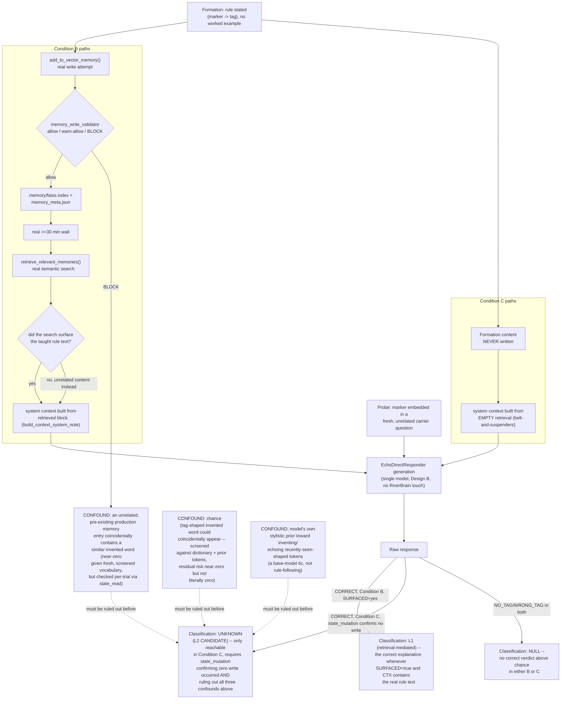

# P3-CAUSAL-LEARNING — Causal DAG

Design-only. This document lays out, as a directed acyclic graph, every path by which a
`CORRECT`/`CORRECT_WITH_CONTAMINATION` tag verdict could arise in Condition B or C, and which of those
paths this design's controls close off, versus which remain open as genuine confounds requiring
careful attribution rather than assumption.

## Reading the DAG

- **Every path into a Condition-B correct verdict passes through `SURFACED` — whether the real
  retrieval mechanism actually found the taught rule text.** This design's `state_read` instrumentation
  makes this directly observable per trial (the Learning Investigation's own pilot already showed this
  is not guaranteed to happen even when the content was genuinely written). A correct verdict in B
  with `SURFACED=yes` is cleanly, structurally L1 — there is no other path to it in this graph.
- **Condition C has exactly one path to `GEN`, and it never passes through any real memory
  content.** This is the entire point of the design: if a correct verdict occurs here, the DAG shows
  there is no confirmed causal path from Formation to that response *except* through whatever
  persistent state the model's own weights/session carry — which, per the architecture mapping
  document, `EchoDirectResponder` is confirmed to hold none of (no cross-call memory of any kind).
- **Three confound paths are drawn explicitly, not glossed over**, because a correct Condition-C
  verdict must be checked against all three before being escalated beyond `UNKNOWN`:
  1. **Chance** — a binary-shaped or otherwise coincidental match. Mitigated but not eliminated by the
     dictionary/forbidden-substring screening (an invented tag word appearing in a response for
     reasons unrelated to the rule is astronomically unlikely given the screening, but "unlikely" is
     not "impossible," and this design does not claim otherwise).
  2. **Model stylistic prior** — some base models exhibit a tendency to echo or invent similarly-shaped
     nonsense tokens under certain prompt conditions, unrelated to genuine rule-following. This is a
     real, documented-in-the-literature LLM behavior class, not specific to this design, and must be
     considered before crediting a Condition-C success to rule retention.
  3. **Unrelated production-memory leak** — since Condition C's probe still runs through
     `EchoDirectResponder` (which itself does not query memory, per the architecture mapping), this
     specific confound path is structurally closed for THIS design's own probe call — drawn here for
     completeness and to make explicit that it is closed by construction, not merely assumed away.

## What this DAG does NOT let this design claim

No path in this graph terminates directly at "L2 confirmed." The strongest possible outcome this
design can produce is `UNKNOWN (L2 CANDIDATE)` — a result that, after every known confound is checked
and found not to explain it, would warrant a dedicated, separate, adversarially-designed follow-up
investigation specifically built to explain the anomaly. This is a deliberate, structural feature of
the design, not a limitation to be worked around: per the mission's own rule, "if unknown → UNKNOWN,
not learning," and per the two prior architecture audits' own conclusions, the prior probability of a
genuine, currently-unidentified L2 channel existing in this codebase is low enough that a single
pilot's positive result should never, on its own, be reported as more than a candidate for further
work.
